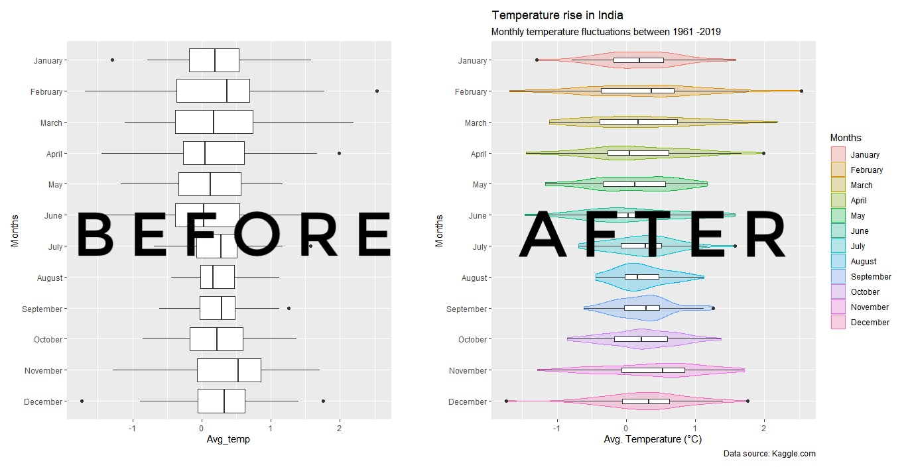
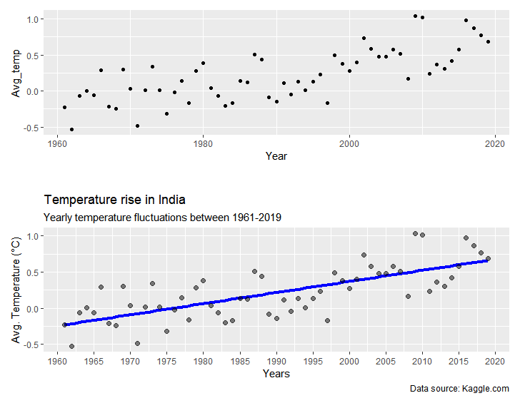
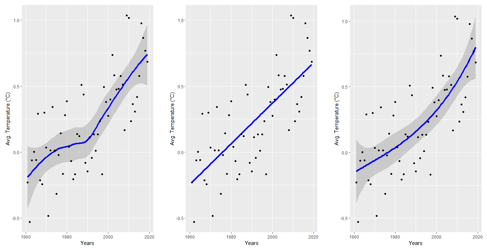
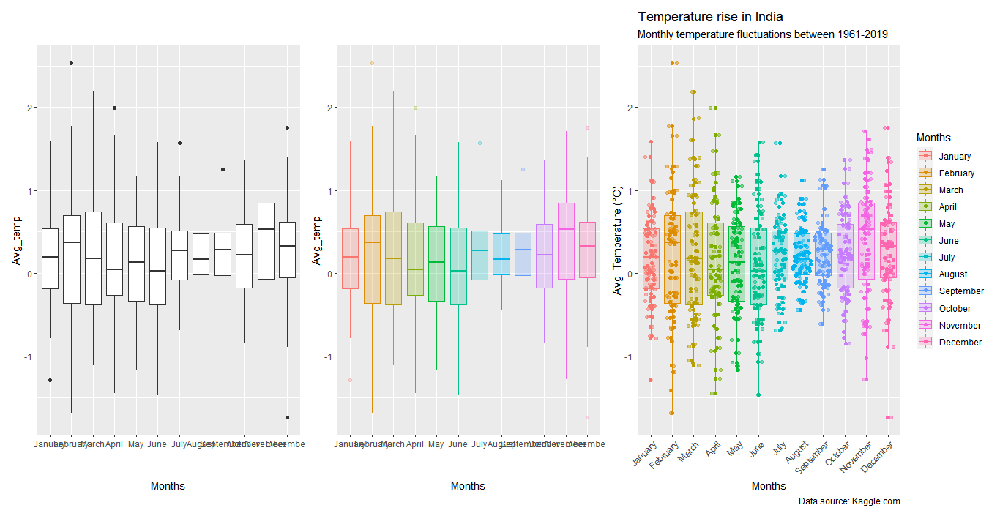
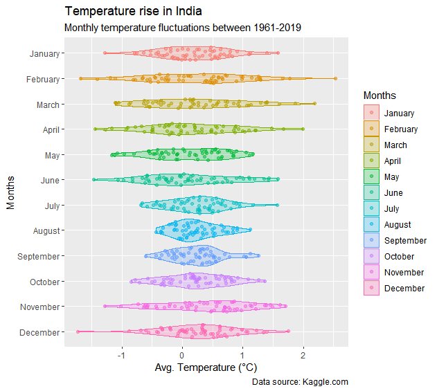
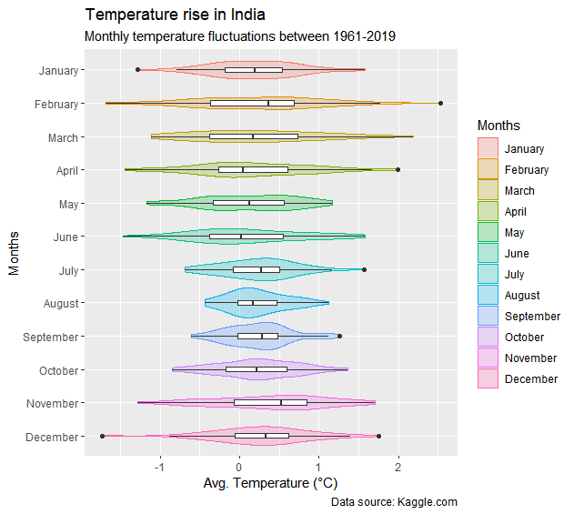

**The blog first appeared on Towards Data Science on Feb 24th, 2021. ([Link](https://towardsdatascience.com/master-data-visualization-with-ggplot2-scatter-and-box-plots-2f0c14cf2b26?sk=d68131a2be91f5b698d9b1652f244bc6))**

R users focusing on dashboards or data visualizations are inherently dependent on the `ggplot2 package`. It is the versatile package for plotting data based on the Grammar of Graphics. The idea behind it uses semantics like aesthetics, scales, and layers to build the visualization.

Here is a goto tutorial series for people who are looking for quick solutions with limited time on hand to polish their visualizations. This is a four-part series dealing with plotting different styled plots using `ggplot2` packages and other add-on packages. These tutorials are as follows:

**_1. Scatter and box plots_**

_2. Bar plots, Histograms, and Density plots_

_3. Circular plots (pie charts, spider plots, and bar plots)_

_4. theme(): create your own theme() for increased workflow_

In this tutorial, we will work on creating scatter and box plots. After this tutorial, you will be able to make much better visualizations as shown below.

----

## Dataset and packages

For this tutorial, we will be using the global temperature change recorded for the years between 1961 to 2019 for most of the countries. The dataset can be downloaded from [here](https://www.kaggle.com/sevgisarac/temperature-change). For the time being, we will focus on the temperature change that occurred in India.

The packages used for this tutorial are:

`tidyverse`: used for all the manipulations to get the dataset in the right format for plotting purposes

`ggplot2`: for plotting the data

`ggforce`: control the width of the jitter using the density distribution of data

`patchwork`: combining different plots to make a single image

----

Once the packages are loaded and the data is processed according to the requirements, we are ready to create our first plot. We will start with the scatter plot and then move to the box plot.

## Scatter plots

This is one of the most popular and goto plots when doing EDA. The plots are used to show the relation between multi variables. In the below image, the top plot is the default scatter plot using just the `geom_point()` without any aesthetics or additional layers.

So, to add value to the scatter plot we added the title, subtitle, caption, title to the axis. A further add-on to the above plot is adding a fitting line to the data to make it more meaningful. The fittings are more informative giving an overview of the trends and the correlation between the variables. We added a linear fit to the data that shows a positive trend in the rise in temperature over the years. By adding all these features to the above scatter plot, we made it more self-explanatory.

Sometimes the behavior of the data is more complex and in those cases, a linear fit is not an option. For these types of cases either we can use the default smoothing function or define our own function.
Below we can see three plots, one on the left uses the default `geom_smooth()` function, the middle one uses the linear fit and the rightmost uses the user-defined function.

> _By default, stat_smooth or geom_smooth uses LOESS (if data points are less than 1000) or GAM (for data points more than 1000) functions for fitting._

----

## Box plot

Box plots are relevant when an experiment is conducted plenty number of times and one wants to understand the statistical significance of the outcome. It provides information about quartiles (25%, 50% or mean, and 75%), inter-quartiles, standard deviations, and outliers.

We add `geom_boxplot()` to the default ggplot() layer. And then we add the `geom_ jitter()` layer to add the data points and further add `geom_sina()` from the `ggforce` package to control the width of the jitter. The `col` and `fill` in the aesthetics of `geom_boxplot()` are defined to color code the months.

The above plots can be further improved by adding transparency to the data points to provide emphasis on the data distribution especially on the overlapping ones. This achieved by defining `alpha` in `geom_boxplot()`. The `alpha` value ranges between (0,1) where 1 is 100% transparent.

The plot can be made sassy by using the `geom_violin()` function. An aesthetically pleasing variation of the box plot is the violin plot.

If we compare the violin plot and box plot, we see the axis rotated for the two cases. This achieved by the `coord_flip()` function. By flipping the axis, the order of the months reverses, and to bring it back to the natural order of months in the calendar we use `scale_x_discrete(limits = rev)`.

If we look at the above violin plot we see that it can be visually appealing but it lacks information when compared to a box plot. To make the violin plot as informative as the box plot without losing its charm, one can take the help of layers. This is the beauty of the `ggplot2` package that any number of layers can be added. So, by adding a box plot layer we add information of quartiles, standard deviation, and outliers to the violin plot as shown below.

The `coef` variable defined in the `geom_boxplot()` function defines the length of the standard deviation arm, the default value is 1.5.

----

## Conclusion

We talked about scatter plots and box plots and showed how by adding layers and aesthetics, we can drastically improve the quality of the plots. The quality of the plots was enhanced by making them more informative. There were two types of information added: one adding meaning to the plots which were in the form of the smooth fitting, and the other being descriptive in nature like adding the axis titles, plot title and subtitle, and adding figure caption.

In the next article, we will talk about bar plots, histograms, and density plots.

The link to the complete code is [here](https://github.com/amalasi2418/Blog-post/tree/master/ggplot2%20tutorial%201).