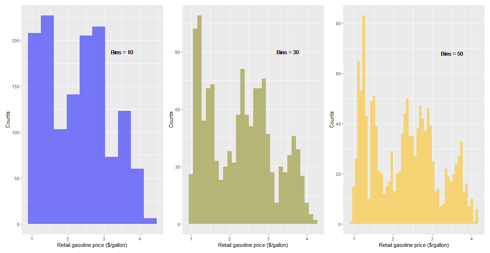
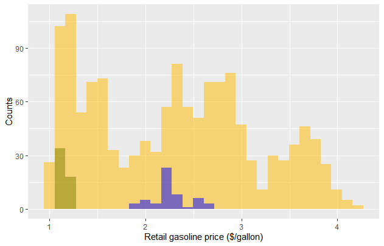
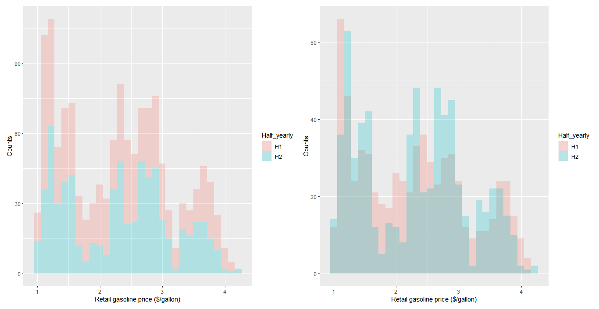
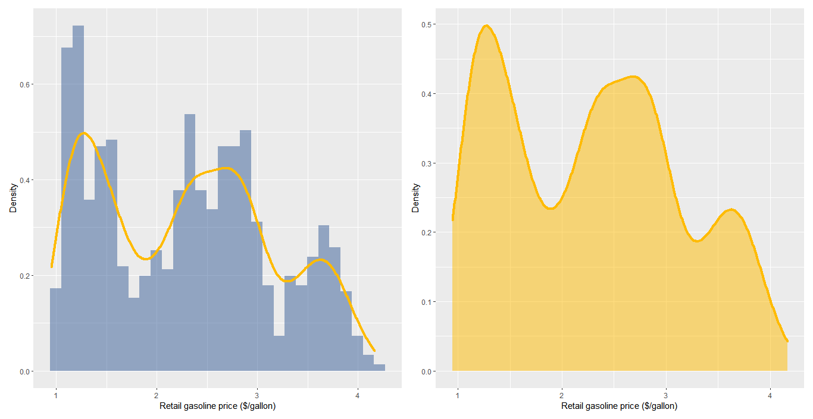
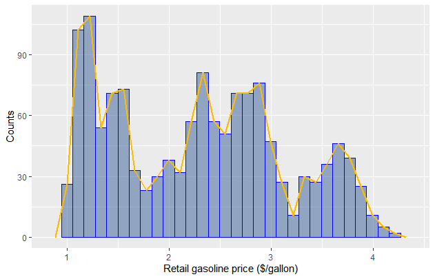
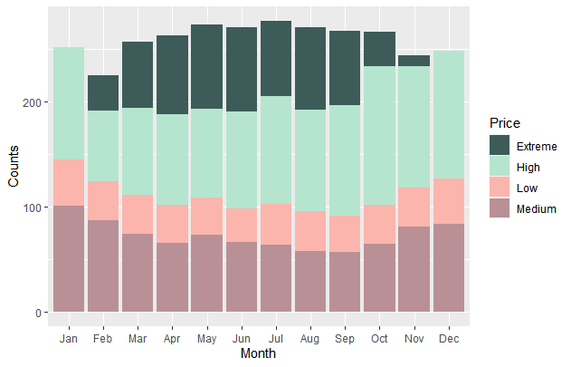
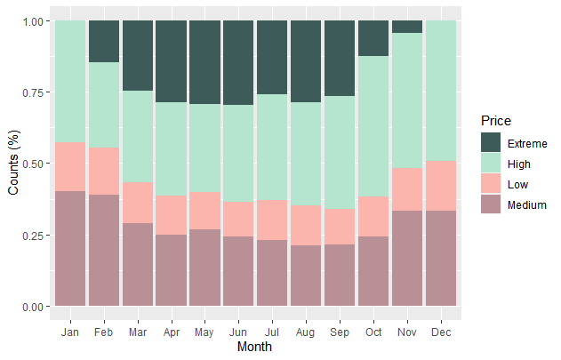
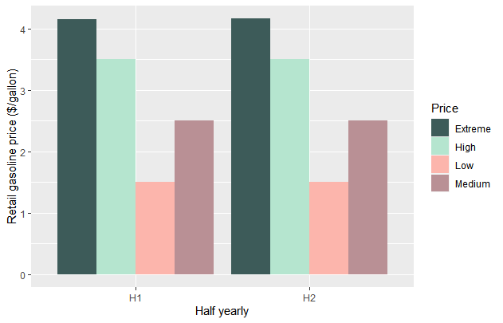
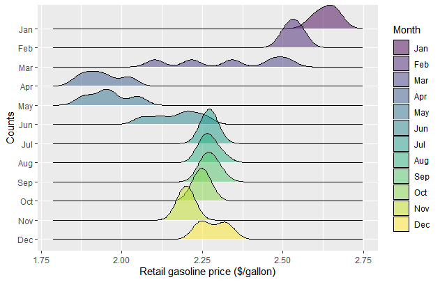

**The blog first appeared on Towards Data Science on Mar 2nd, 2021. ([Link](https://towardsdatascience.com/master-data-visualization-with-ggplot2-histograms-bar-and-density-plots-86c8290c9adc?sk=17339a5298df8451cd6d0387f83eca4a))**

This is the second in the series on creating data visualizations using `ggplot2` package. The list of the tutorials are as follows:

_1. Scatter and box plots_

**_2. Histograms, Bar, and Density plots_**

_3. Circular plots (pie charts, spider plots, and bar plots)_

_4. theme(): create your own theme() for increased workflow_

In this article, we will cover the difference between the histograms, bar plots, and density plots and when to use them, and how to plot the different variations.

> The major difference between histograms and bar plots is that histograms are used to plot the frequency distribution of quantitative variables while bar plots are used for categorical variables.

Without wasting any time let’s dig in.

----

## Data and packages

The weekly gasoline and diesel retail price data for the years between 1995–2021 are taken from Kaggle. The dataset can be downloaded from [here](https://www.kaggle.com/mruanova/us-gasoline-and-diesel-retail-prices-1995202). For plotting purposes, the A1 gasoline price is only considered. New columns are created by extracting the year, month, and week data for the given prices. Further, the retail price is categorized as low, medium, high, and extreme and assigned to `Price` variable. Another variable created is `Half_yearly` for segmenting the year into two halves or 2 categories for demonstration purposes.

The additional packages used apart from the ones already discussed in [part 1](https://towardsdatascience.com/master-data-visualization-with-ggplot2-scatter-and-box-plots-2f0c14cf2b26) of the series are:

**_lubridate_**: use for handling dates and time in R

**_ggridges_**: for plotting density ridgeline plots

## Histograms

We will be using the `geom_histogram()` function for plotting the histograms. Histograms are used for plotting a continuous single variable. Basically, what a histogram does is plot the frequency of the occurrence of the variable in the data.

For the time being, let's start by plotting the gasoline price for the years 1995-2021. So depending on the data distribution one can adjust the bins. By adjusting the bins, we are dividing the x-axis interval size. By default, the bins in `geom_histogram()` has a value of 30. In the below image, we plotted the data for 3 different bin sizes of 10, 30, and 50. By changing the bin size, the x-axis interval changes. As the number of bins is increased, the x-interval values keep going smaller which is evident from the bar thickness.

Another variation of the histogram is to show overlapping. This is possible in 2 ways. The first one is to overlap the data subset on the mother data. In this example, we overlap the previous year's data and see how it compares to the total price distribution of gasoline over more than 2 decades. This is achieved by adding layers to the histogram after subsetting the data using `subset`. Let's say we want to compare values of 2 different years with the total distribution then we add 3 layers of the histogram. The data for the additional histograms is taken as the subset of the mother data. In the below image we compare the price distributions for the years 1995 and 2020. And this plot clearly shows the distributions against the total and also the shift in the gasoline prices and thus makes comparison easy.

The second possibility of overlapping histograms is when the dataset is segmented. Like in the below case, by adding the `position = “identity”` argument in the `geom_histogram()` the stacked histograms convert to overlapped histograms as seen in the below image. On comparing the two plots, one can see the change in the number of counts in the overlapping regions as the previously stacked data had a higher count due to aggregation but this is not the case in the second plot as the data is now overlapping with each other and giving a better picture of how the half-yearly data compares.

## Density plots

The density plot represents the distribution of the numeric variable. It is plotted using the `geom_density()` function. It can be plotted separately or can be overlapped on a histogram by adding a layer. For overlapping the density plot on the histogram, we have to define `aes(y=..density..)` as the argument for the `geom_histogram()` function. The line thickness or the line type can be controlled by the following arguments in the `geom_density()` function: `size` and `linetype`, respectively.

## Frequency plot

Like density plots, we can use frequency plots. The difference between the two is that the frequency plot connects the counts of the histogram while the density plot talks about the distribution. We use `geom_frequency()` function for plotting purposes.

## Bar plots

Bar plots are used to compare the performance of the categorical data. So to make the given data categorical, we have divided the gasoline prices into 4 different categories of the low, medium, high, and extreme price range. We use `geom_bar()` function for plotting purposes. One of the key argument in the `geom_bar()` function is `stat=”identity”` . There exist another argument of interest which is `position`. `position` argument tells how the bars for the categorical data arrange. The default value of `position` argument stacks the bars on top of each other and the y-axis value is the total aggregate value. When `position=fill` , the stacking is done on the percent share and the maximum value of the y-axis is 1 or 100%. If `position=dodge` then the stacking is done horizontally as shown for the data for `half_yearly`.

## Density ridgeline plots

The last and the most interesting of all the plots is the density ridgeline plots. These plots are the extension of density plots stacked along the y-axis. They give visual clarity on understanding the changes occurring over time and space. `geom_density_ridges()` function comes from the `ggridges` package. In this plot, we can observe the price distribution of gasoline for the year 2020 occurring over different months.

## Conclusion

In this article, we demonstrated the difference between histograms and bar charts, for what type of variables are the charts applicable, and the different variations. Further, we learned on building the following plots:

1. Histograms

2. Density plots

3. Frequency plots

4. Bar plots

5. Density ridgeline plots

I hope this was insightful, in the next article from the series we will be talking about circular plots: pie charts, spider plots, and bar charts.

The link to the complete code is [here](https://github.com/amalasi2418/Blog-post/tree/master/ggplot2%20tutorial%202).