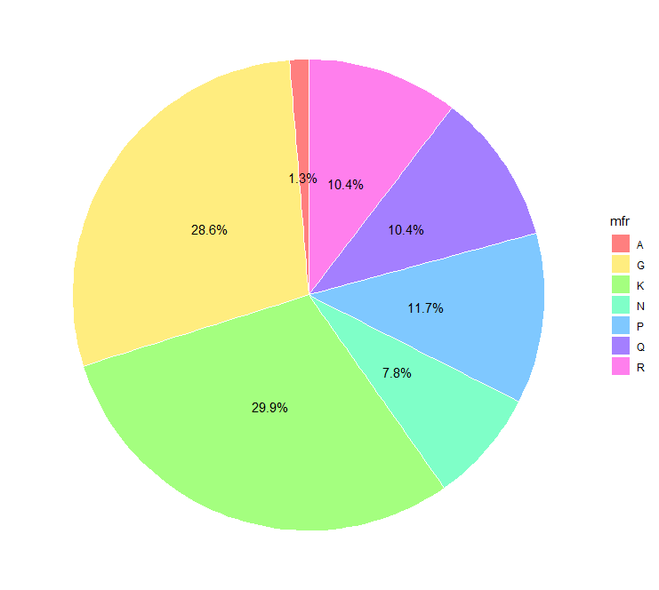
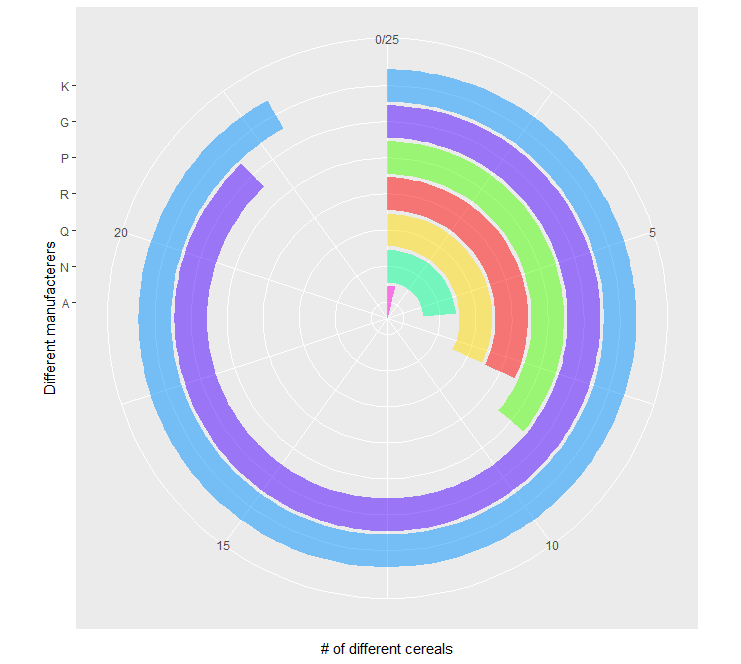
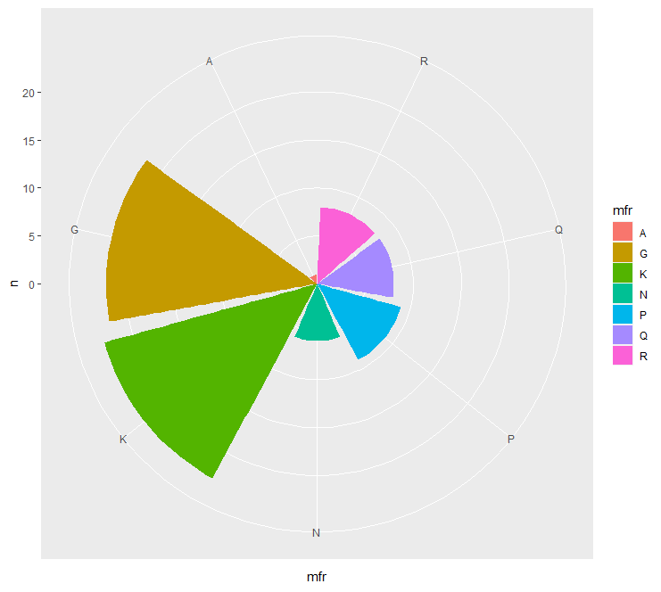
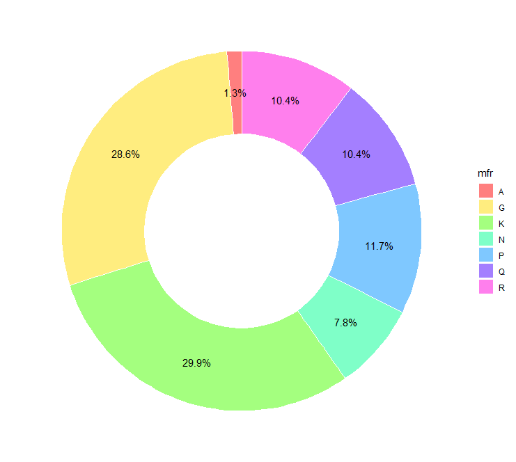
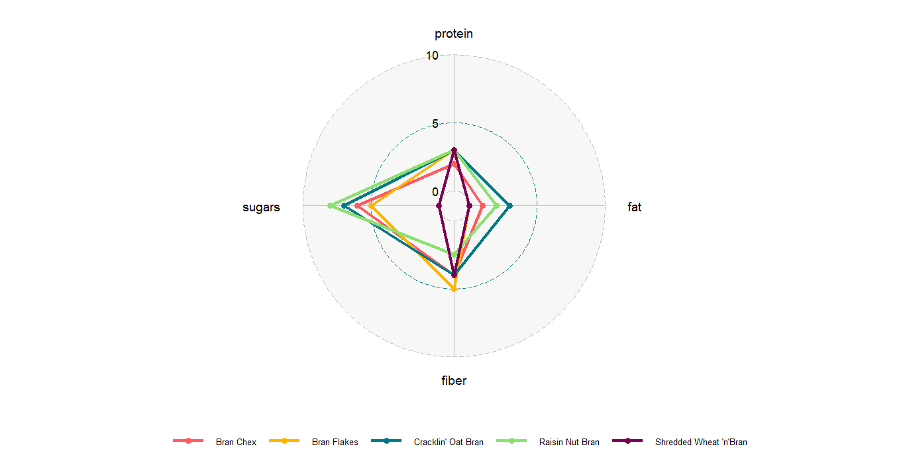

**The blog first appeared on Towards Data Science on Mar 19th, 2021. ([Link](https://towardsdatascience.com/master-data-visualization-with-ggplot2-pie-charts-spider-plots-and-bar-plots-899a07a15827?sk=fb8529750b14cf1fe0ea4c9023a31e6d))**

In the third part of the data visualization series with ggplot2, we will focus on circular plots. The list of the tutorials are as follows:

_1. Scatter and box plots_

_2. Histograms, Bar, and Density plots_

**_3. Circular plots (pie charts, spider plots, and bar plots)_**

_4. theme(): create your own theme() for increased workflow_

So, under circular visualizations, we will be covering on how to create the following charts:

1. Pie charts

2. Spider charts

3. Circular bar plots

Further, we will discuss the pros and cons of using these types of visualizations.

> **_With great power comes great responsibility, use pie and spider charts wisely._**

## Data and packages

For creating visuals for circular plots, we will be using the breakfast [cereal dataset](https://www.kaggle.com/crawford/80-cereals) from Kaggle. The dataset has 77 unique cereal types with 16 fields.

We will be creating two new variables: _manufact_ (contains the count of different cereal manufacturers) and _cereal_Bran_low_ (filtered nutrition data for selected Bran cereal brand with calorie value between 80 and 120).

In the third part of the series, as usual, we will be using `ggplot2` and `tidyverse` which are the basic packages widely used. Apart from them, for plotting spider or radar plot, `ggradar` package will be used.

## Pie charts

For creating Pie charts, we will be using the _manufact_ variable. There is no defined function for creating Pie chart in `ggplot2` package, although the base plotting in R has `pie()` function. In order for us to plot Pie charts using ggplot2, we will use `geom_bar()` and `coord_polar()` functions to create segments of a circle. `coord_polar()` function converts the cartesian coordinates to the polar coordinate system, this way it is easy to create circular plots. The x argument for the `ggplot()` aesthetics is assigned as `x=“ ”` and the `theta` argument is assigned `y` value in the `coord_polar()` function.

**To convert a bar chart to a pie chart, set `stat=“identity”` in `geom_bar()` and fix `width=1`.**

**Pros**: useful when comparing few data points.

*Cons*: difficult to interpret for large datasets, hard to depict trends overtime

The modification of the pie chart leads to the donut chart. The size and the thickness of the donut can be manipulated by controling the x argument of the aesthetics of `ggplot()`. *_Make sure the value of the x argument lies between the xlim range._*

## Bullseye chart

For creating a circular bar plot, set argument `stat=“identity”` in `geom_bar()` function. Make sure to arrange the bars in increasing order of length when going radially outwards. For converting the bar chart to circular orientation set argument `theta=“y”` in the `coord_polar()` function. If the color bars complete one complete round then the chart will resemble a bullseye, hence the name.

## Coxcomb chart

Simply changing a single argument in the bullseye chart will lead to coxcomb chart. Instead of assigning `theta=“y”` if its changed to `theta=“x”` in the `coord_polar()` function, we get coxcomb chart.

## Spider charts

Currently, there is no function in `ggplot2` package to create spider or radar charts. `ggradar` package is compatible with `ggplot2` package to that can be used to create spider charts. In `ggradar()` function, as in `ggplot()` function, the aesthetics can be defined. Few important arguments required are:

_values.radar_: prints the minimum, mid, and maximum values of the circular grid lines.

_grid.min_: minimum value of the grid

_grid.mid_: middle value of the grid

_grid.max_: maximum value of the grid

*Pros*: easy to understand if all the variables have the same scales.

*Cons*: difficult to compare when the scales have different units, hard to interpret circular plots.

The complete code for plotting all the charts.

## Conclusion

So in this tutorial, we saw how to create pie charts, spider plots, coxcomb charts, and bullseye charts. Identified how the pie chart can easily be converted to other chart types except for the spider plot by changing a couple of arguments either in the aesthetics of `ggplot()` function or in `geom_bar()` function. We further discussed the pros and cons of using circular chart types (especially pie charts and spider plots, bein the popular ones) and saw that in general these charts are discouraged and their alternatives are used which are easy to understand and interpret.

### References

https://www.kaggle.com/crawford/80-cereals

https://blog.scottlogic.com/2011/09/23/a-critique-of-radar-charts.html#chart2

https://www.data-to-viz.com/caveat/spider.html

The link to the complete code is [here](https://github.com/amalasi2418/Blog-post/tree/master/ggplot2%20tutorial%203).