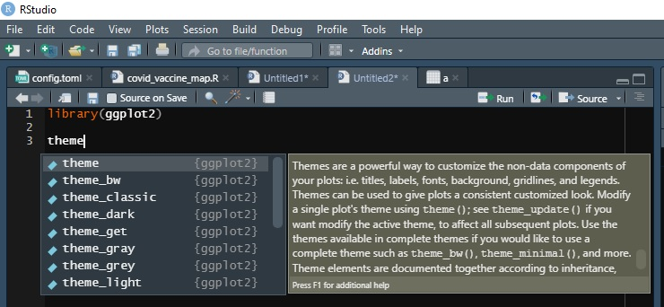
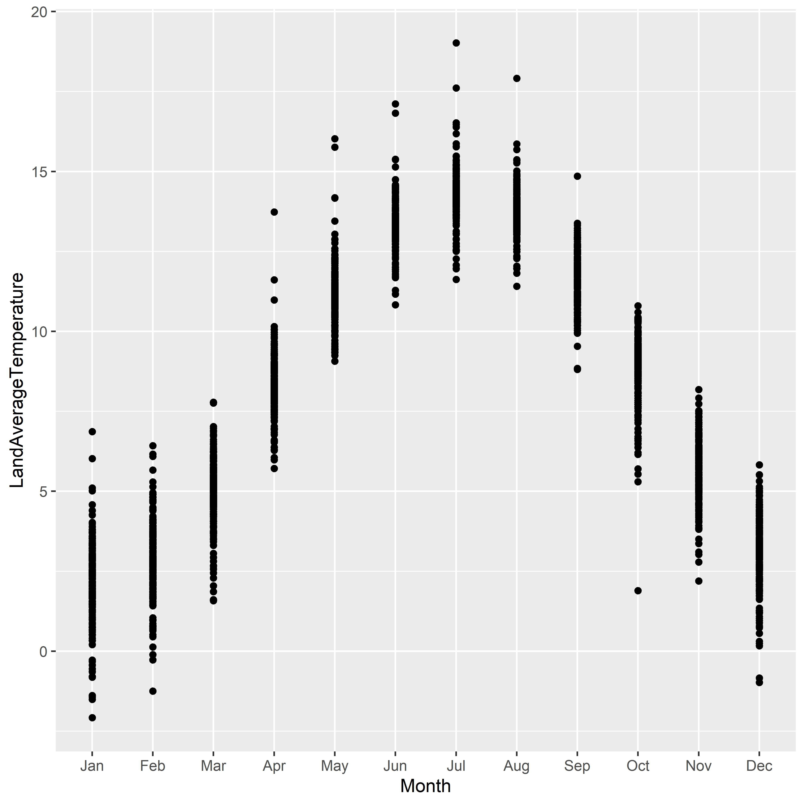
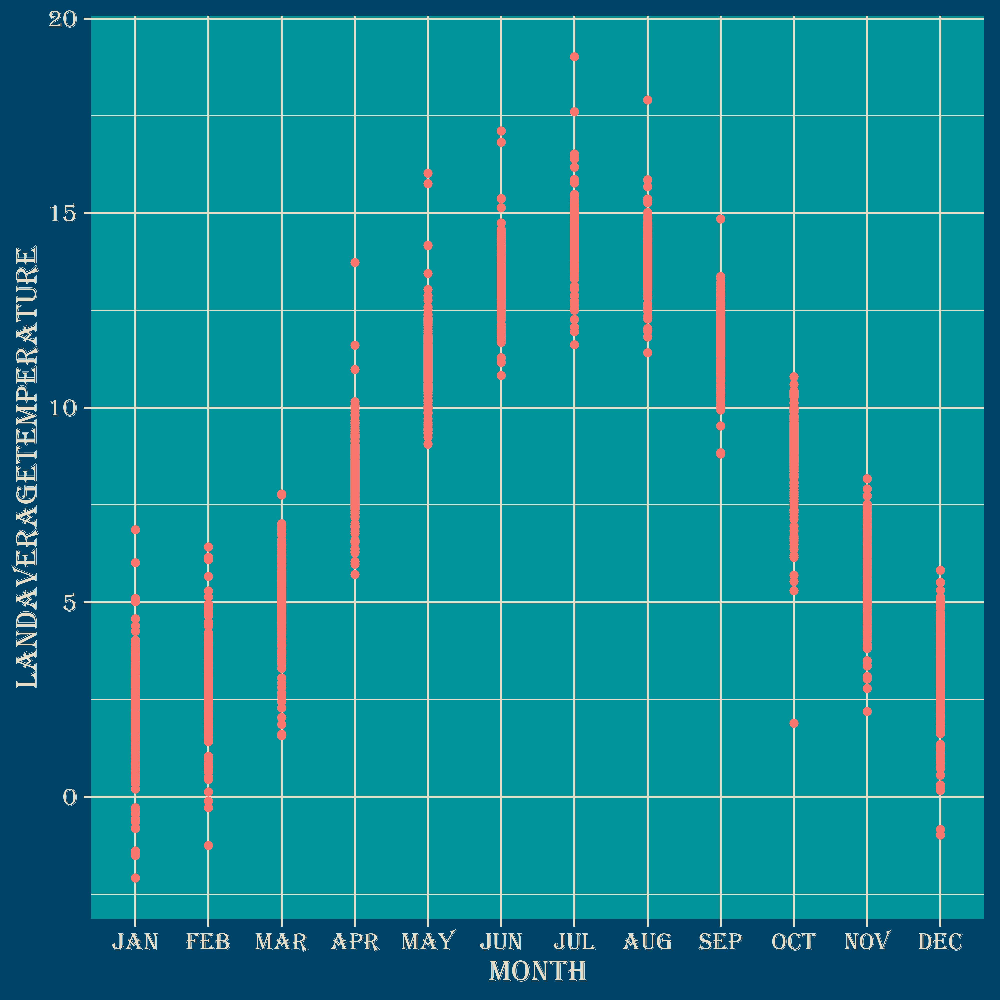
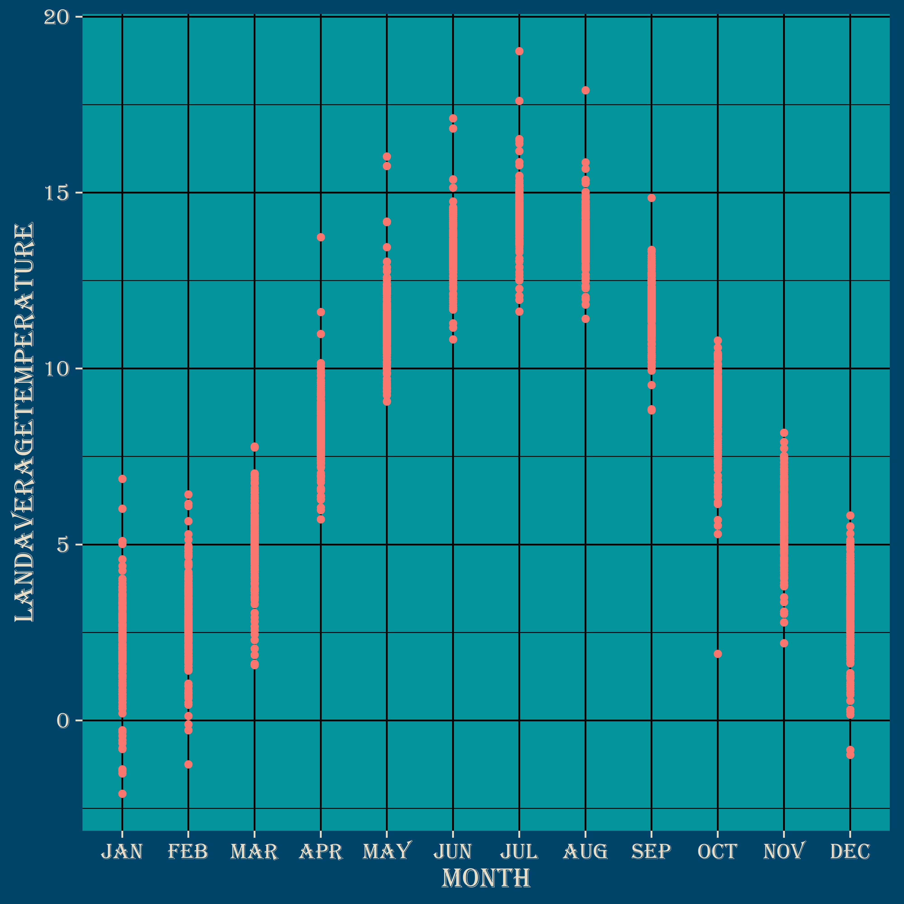

**The blog first appeared on Towards Data Science on Mar 25th, 2021. ([Link](https://towardsdatascience.com/master-data-visualization-with-ggplot2-theme-customization-8421695d24e2?sk=d1592d6b38d7412cf47afedc0912303a))**

This is the last article from the series master the data visualization using the ggplot2 package. The complete list of tutorials are as follows:

_1. Scatter and box plots_

_2. Histograms, Bar, and Density plots_

_3. Circular plots (pie charts, spider plots, and bar plots)_

**_4. Theme(): customize to increase workflow_**

Theme customization is key to increasing work efficiency for those who are regularly changing the default theme settings to make their visualizations more attractive. The default theme used by `ggplot2` package is `theme_gray()`. So, for this tutorial, we will use the `theme_gray()` function to create our own customized function, `theme_customized()`. We will divide this tutorial into the following sections:

1. Dataset & packages

2. Extracting the theme function

3. Customizing the theme function

4. Overriding certain parameters



## Dataset and packages

For this tutorial, we will be using the earth surface temperature dataset focusing on the global temperature changes between 1750–2015. The link for the dataset is [here](https://www.kaggle.com/berkeleyearth/climate-change-earth-surface-temperature-data).

We will use the `lubridate` package to create new variables with information on Year and Month.

Apart from the `ggplot2`, `tidyverse`, and `lubridate` packages, we will be using the `extrafont` package to import more fonts into R from our OS. As I am a Windows user, the arguments will be related to Windows OS. Check the reference for installing using Apple or Linux systems.

So, let us now start to customize the theme which will be done by extracting the source code of the default theme function.

## Extracting the theme function

To get the source code of a function in R, just type in the function name in the R console and press enter. This way it will provide you the entire code. In our case, we will be using `theme_gray()`, so we can just run `theme_gray` on the console and we will get complete source code as shown below.

<script src="https://gist.github.com/amalasi2418/8340701f8da1551f96e542b4168aad15.js"></script>

We will be using the above code to create our customized function. Before going any further into customization, we will get rid of the last command `ggplot_global$theme…`.

## Customizing the theme

A lot can be customized in the default theme but for the time being, we will focus on few key things. Feel free to explore the other possibilities.

### Fonts

The default font families available in R are _sans_, _serif_, _mono_, and _symbol_. If you are looking to add more font families to your existing fonts in R, then that can be achieved by `extrafont` package. Use the following code snippet to add fonts to R for customization in Windows OS.

<script src="https://gist.github.com/amalasi2418/182c881971d1f27151cc448cff6ba7ce.js"></script>

To assign the font of your choice just state it in the function argument when calling the function. For demonstration purposes, I have assigned `base_family=“Algerian”`.

```{r}
theme_customized <- function(base_size=11, base_family = "Agerian", 
                             base_line_size = base_size/22, 
                             base_rect_size = base_size/22)
```

### Colors

The default colors can also be overridden by assigning new colors. For example, the background color of the plot panel can be changed from `white` to a different color by providing a different `fill` value as highlighted below:

```{r}
rect = element_rect(fill = "white", colour = "black", size = 0.5, linetype = 1)

# replace plot panel background color to red
rect = element_rect(fill = "red", colour = "black", size = 0.5, linetype = 1)
```

The font color for the axis titles can be changed using the `color` argument in the `element_text()` function.

```{r}
text = element_text(family = base_family, face = "plain", 
                    colour = "black", size = base_size, lineheight =
                    0.9, hjust = 0.5, vjust = 0.5, angle = 0, margin
                    = margin(), debug = FALSE)
```

The color for the axis texts and ticks can be altered using these functions:

```{r}
# axis text
axis.text = element_text(size = rel(0.8), colour = "grey30")

# axis ticks
axis.ticks = element_line(colour = "grey20")
```

### Font size

The default font size for `theme_gray()` is 11, which might not be the of the proper size for some display mediums. So, the default value can be changed to a more desired value by assigning it to the `base_size` argument of the theme function.

```{r}
theme_customized <- function(base_size=11, base_family = "Agerian", 
                             base_line_size = base_size/22, 
                             base_rect_size = base_size/22)
```

Another important feature to notice is the `rel()` function, which defines the relative size with respect to the `base_size` value.

So, let us customize the theme.

<script src="https://gist.github.com/amalasi2418/8175d778dbaef903de67a200030dade0.js"></script>

Now, we know how to customize the theme in R. Let us now put it into practice by visualizing the monthly average temperature variation over the period from 1750–2015.

So for the current customized theme, let us set `base_size` value to 15, `base_family` to _Algerian_, and change the color scheme and use the color scheme of [Canva](https://www.canva.com/colors/color-palettes/facing-forward/).

To override the default theme of `ggplot2`, we will use `theme_set()` function and this way we can implement the `theme_customized()`.

```{r}
# overriding teh default theme
theme_set(theme_customized())  
```

Now we can replot the average temperature variation with our new customized theme.





## Overriding certain parameters

To make quick changes in the theme, we will be using `theme_update()` function. Let's say we want to use black color for the panel grid instead of gray in the custom theme, then we just need to override the value for `element_line()` function.

```{r}
theme_customized = theme_update(panel.grid = element_line(colour = "black"))
```



## Conclusion

In the final tutorial on _mastering data visualizations with ggplot2_ package, we learned to customize our own themes that certainly can boost the workflow especially if your work deals with creating visuals for different sectors requiring different color themes, font types, and sizes. Apart from customizing your theme, we further learned to override the default theme by using `set_theme()` function. Later we saw to make minor changes in the customized theme we can directly use the `theme_update()` function to change values of certain function arguments without revisiting the entire function.

I hope you all enjoyed the series dedicated to plotting with `ggplot2` package. In case you missed any tutorial of the series, the links are posted below. Feel free to comment and share your opinions and views.

### References

https://cran.r-project.org/web/packages/svglite/vignettes/fonts.html

https://r-coder.com/custom-fonts-r/

https://ggplot2.tidyverse.org/reference/theme_get.html

The link to the complete code is [here](https://github.com/amalasi2418/Blog-post/tree/master/ggplot2%20tutorial%204).