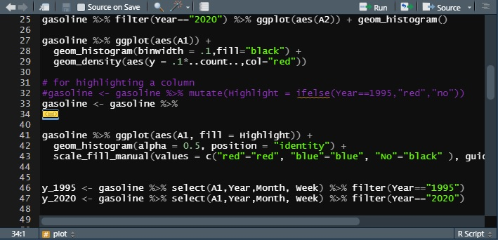
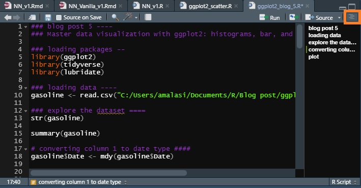
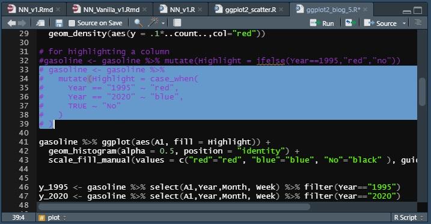
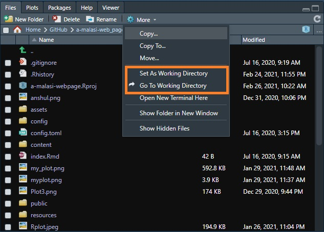
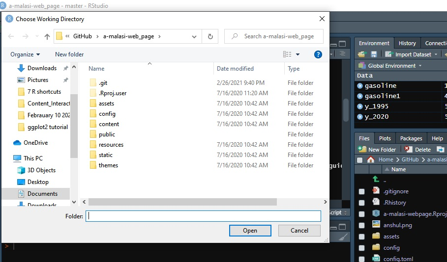
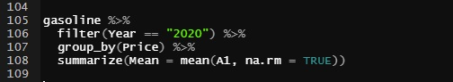
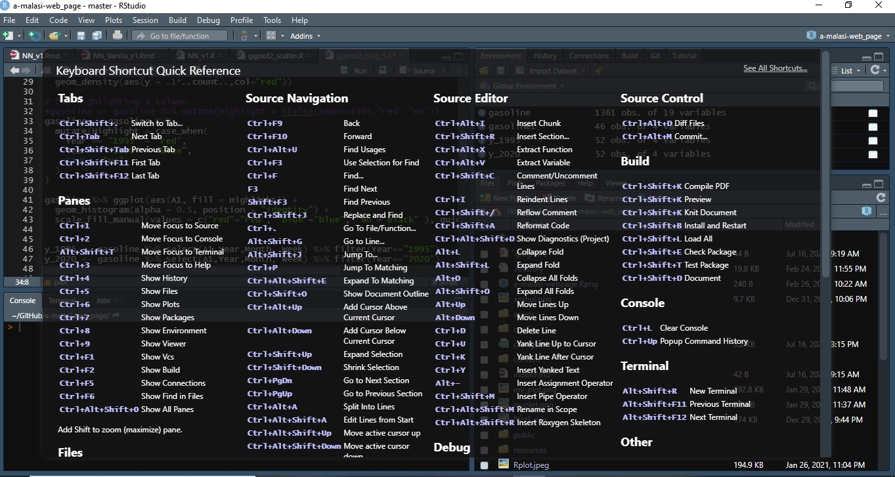

**The blog first appeared on Towards Data Science on Feb 27th, 2021. ([Link](https://towardsdatascience.com/7-shortcuts-worth-knowing-for-efficient-workflow-in-r-cc52c351cb73?sk=177f4a9a0111f3e97ba12b86cc75771c))**

Programming requires a lot of organization which sometimes can be challenging to maintain if working on big coding projects. Maybe it is too annoying to use the mouse all the time to run the highlighted code by mouse clicks. Or routine things like commenting or using a repeated operation get too boring then it makes you think can you find a shortcut for these tasks. All the things mentioned affect the working efficiency.

If you are an RStudio user then these 7 shortcuts discussed below will definitely be handy. How many of these shortcuts do you know beforehand? Are there any new ones for you? Let's read them and find out for yourself.

1. _Hide code_: Hiding the code is handy when your code involves large functions or chunks of code that can be hidden to ease the writing of the code. By using the **Alt+L** shortcut, one can hide the highlighted code which can be expanded back by clicking on the yellow icon with a two-way arrow. Once you close and open the code window again, the hidden code will be in the expanded form.

2. _Show document outline_: Show document outline is like the hyperlinked table of content. By using this feature, it becomes very easy to navigate along with the code when you have 100's lines of code to work on. Add a comment using `#` that will be used for commenting and the comment can be transformed into a heading for the outline. The heading should be preceded by any of these symbols: **#,-, or =, 4** times in a row. If you use the symbols less than three times, they will not appear in the document outline as can be seen in the below image. To view the document outline press **Ctrl+Shift+O**. The orange square in the below image shows the position of the icon for the document outline.

3. _Execute code_: The 2 shortcuts that I use most often to run the code are **Ctrl+Enter** and **Ctrl+Alt+R**. Ctrl+Enter is used when executing the code line by line. Also, a highlighted chunk of code can also be executed by this command. If you are looking to run the complete code, then **Ctrl+Alt+R** should be used.

4. _Comment/Uncomment_: To comment on a chunk of text or a multi-line code that might not be in use now but should be kept for reference then **Ctrl+Shift+C** is the solution. By using the mentioned shortcut key, simultaneously multiple selected lines can be commented on or uncommented.

5. _Choose working directory_: Do you always forget to choose the working directory in the cheer excitement of writing the code or is too cumbersome to choose the working directory option from the Files>More section in the RStudio panel. The below image with the highlighted orange box shows the location for setting the working directory.

Then the shortcut for choosing the working directory, **Ctrl+Shift+H**, can do wonders for you. By using the shortcut, a popup window opens as shown in the below image.

6. _Pipe tool (%>%)_: One of the most useful operators in R from the **Magrittr** package. The pipe tool is useful to perform multiple sequential tasks. The shortcut for the pipe tool is **Ctrl+Shift+M**.

7. _Open shortcut panel in RStudio_: If you struggle to remember all of the above-mentioned shortcuts then you just need to remember **Alt+Shift+K**. This is the gateway to all the shortcuts that can be used in RStudio whether you are working with an R script, Notebook, or Markdown.

### Conclusion

In this article, we discussed 7 shortcuts to improve the workflow in RStudio:

1. Hide code

2. Show document outline

3. Execute code

4. Comment/Uncomment

5. Choose working directory

6. Pipe tool

7. Open shortcut panel in RStudio

We saw the 7 shortcuts and how they can be implemented in R. The best way to remember is to try them now and see how they affect your workflow. If you think any one of these can improve your workflow then just keep on utilizing them. If you have a hard time remembering the shortcuts then you just have to remember **Alt+Shift+K** and this will lead to the shortcut panel for RStudio.

Share your R shortcuts that made your life easier in the comments. Do tell me which one of them you liked the best. Happy coding!