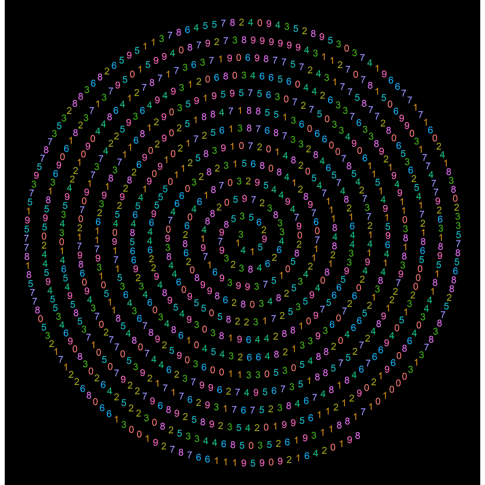
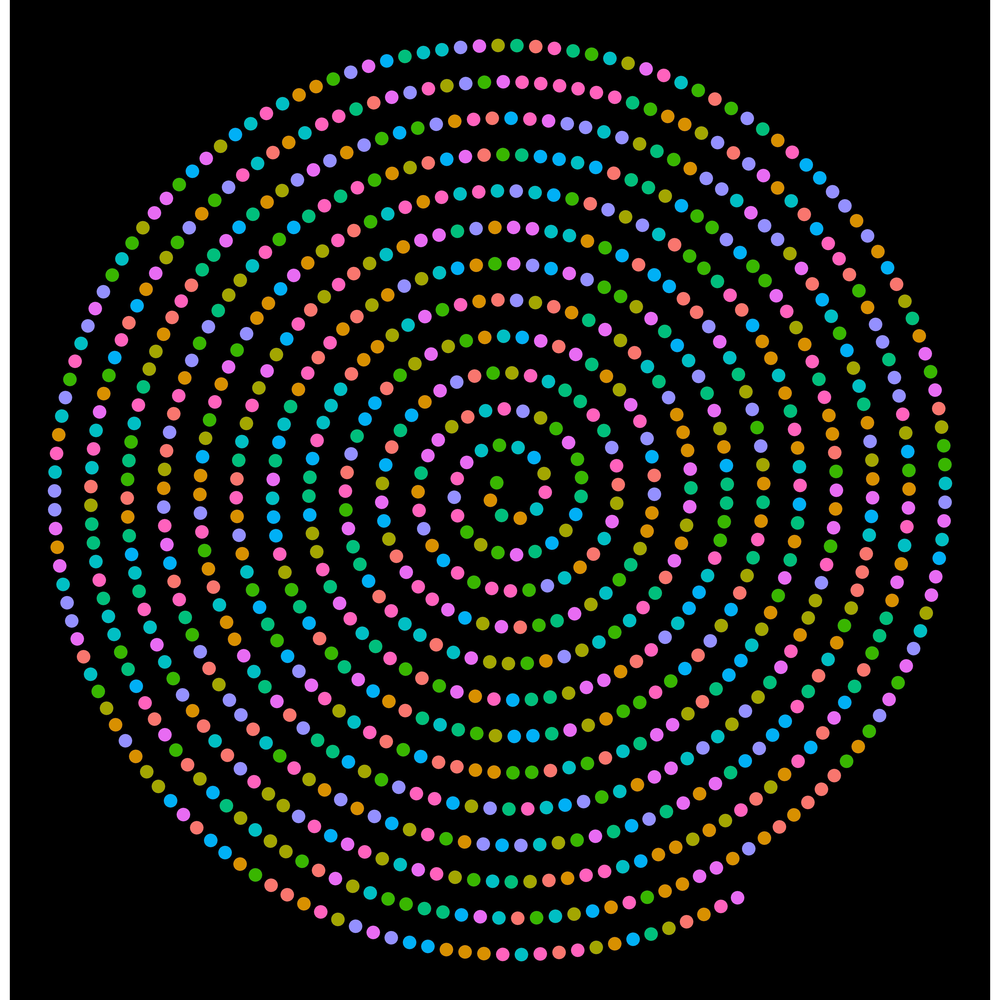
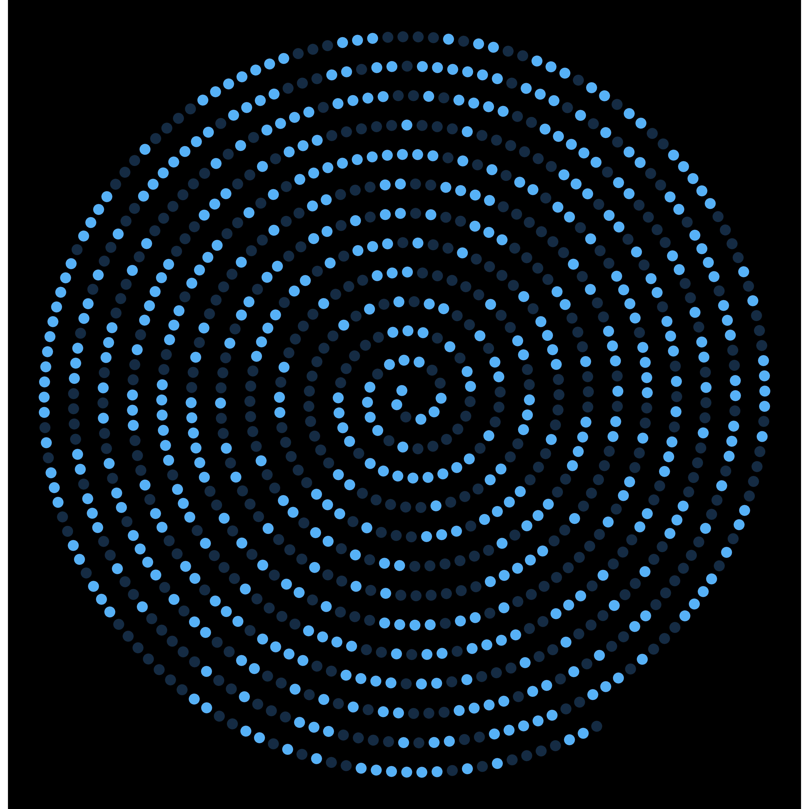
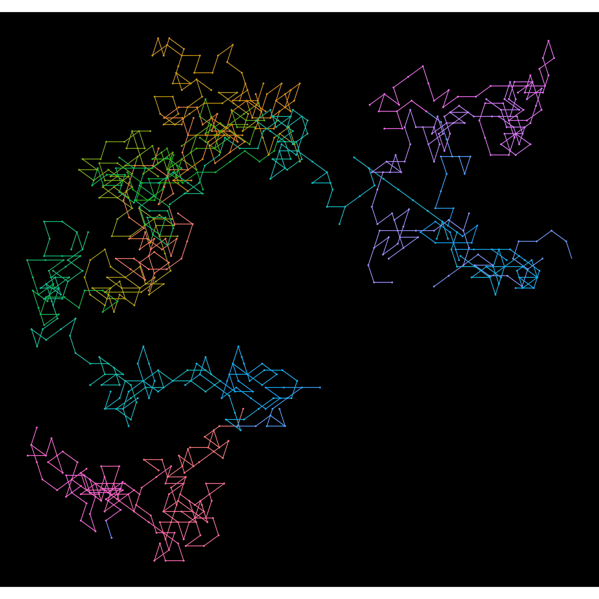
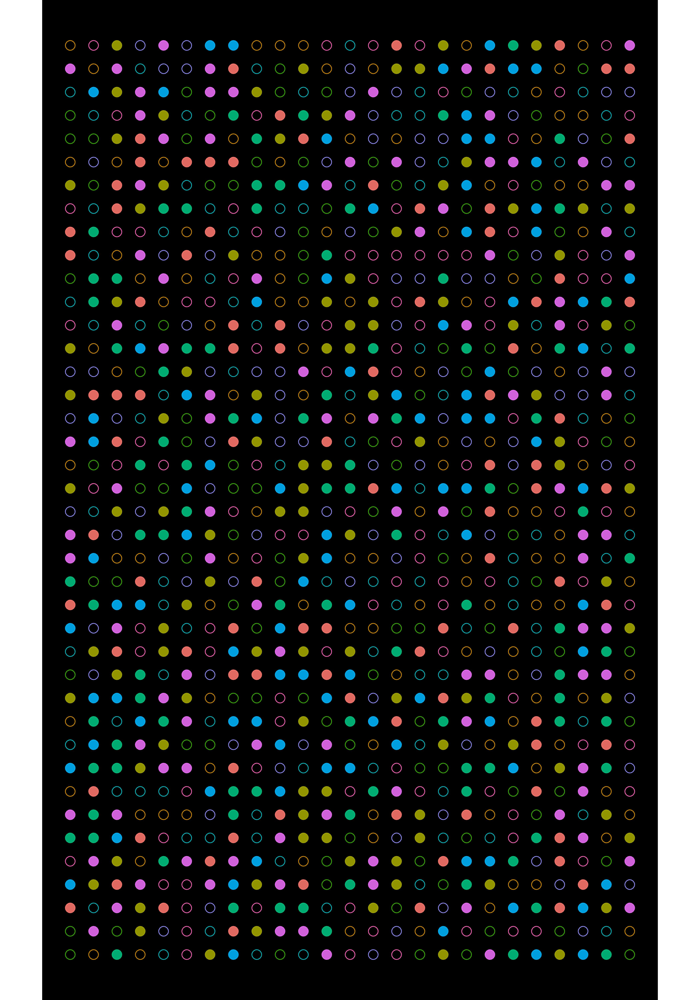
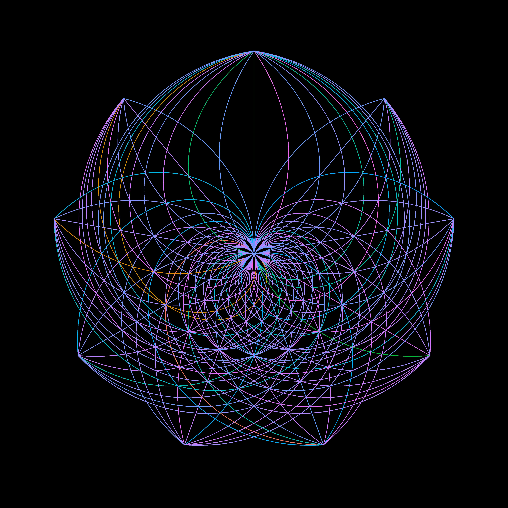

**The blog first appeared on Towards Data Science on Mar 14th, 2021. ([Link](https://towardsdatascience.com/the-hidden-beauty-of-pi-a694422a0740?sk=b7d675d419cae623577c60b4f0c5793c))**

Apart from being the birthday of Albert Einstein, March 14 has a special significance. This day also has a nerdy twist to it being written as 3.14, being the approximation of pi constant, the day is officially celebrated as π day. Often people celebrate the day by baking or eating pie.

The mathematical constant is calculated by taking the ratio of the circumference of the circle to its diameter. In 2019, Google’s employee Emma Haruka Iwao, broke the Guinness Book of World Record by calculating the value of pi to the 31 trillion digits. The precise number of digit calculated were 31,415,926,535,897 (see the correlation). It took about 121 days using 25 virtual machines to perform the calculations.

For practical purposes, we won’t be using accuracy as high as going to the trillionth decimal place. In realistic scenarios, the pi approximation might be limited up to the 5th decimal place, as the error caused by the approximation would be tending to zero. NASA’s director & chief engineer explains the accuracy up to which the value of the Pi constant is used by NASA engineers, which is till 15th decimal place.

So, what is the use of these many digits of Pi? Creative minds found the use for Pi digits in the form of data art, which makes the infinite series finite and restricted to a digital canvas. Here are my replications in R of some of the Pi art created by [Martin Krzywinski](http://mkweb.bcgsc.ca/pi/).

For creating the visuals, I have considered the first 1000 digits of Pi.

### Pi spiraling away

In this visual, the Pi starts from the center of the circle and spirals outwards. The first visual has the 1000 Pi digits plotted along the spiral trajectory which are changed to dots in the second visual. Each individual digit is represented by a color. In the third visualization, the spiral is color-coded with even and odd numbers.





```{R}
digits <- z %>% ggplot(aes(x ,y, color = factor(pie[,1]))) + 
  geom_text(aes(label=pie[,1], color=factor(pie[,1])), size=5) +
  coord_fixed() + theme_void() + theme(legend.position = "none", 
                                       panel.background = element_rect(fill = "black"),
                                       plot.background = element_rect(fill = "black"))


dots <- z %>% ggplot(aes(x ,y, color = factor(pie[,1]))) + 
  geom_point(aes(color=factor(pie[,1])), size=4) +
  coord_fixed() + theme_void() + theme(legend.position = "none", 
                                       panel.background = element_rect(fill = "black"),
                                       plot.background = element_rect(fill = "black"))


dots_even <- z %>% mutate(even=pie[,1] %% 2) %>% 
  ggplot(aes(x ,y, color = factor(pie[,1]))) + 
  geom_point(aes(color=even), size=4) +
  coord_fixed() + theme_void() + 
  theme(legend.position = "none", 
        panel.background = element_rect(fill = "black"),
        plot.background = element_rect(fill = "black"))
```

### Random walk with Pi

For the random walk, the digits 0 to 9 have been assigned directions, and as the digits appear in the Pi approximation, the cursor moves by a unit towards the associated direction thus creating a beautiful rendition.



```{R}
pie %>% ggplot(aes(walk_x2,walk_y2, col = rainbow(n))) + 
  coord_fixed() +
  geom_segment(aes(xend=walk_x1,yend=walk_y1),size=0.5) +
  geom_point(size=.5) +
  theme_void() + 
  theme(legend.position = "none", 
        panel.background = element_rect(fill = "black"),
        plot.background = element_rect(fill = "black"))
{"mode":"full","isActive":false}
```

### Pi onboard

The digits of Pi are color-coded with odd digits are depicted by hollow dots and even digits by solid dots.



```{R}
pie %>% mutate(even = from %% 2) %>% 
  ggplot(aes(x=coord_x,y=coord_y, color = factor(pie[,1]))) +
  geom_point(aes(shape=factor(even)), alpha=0.9, size=3) +  #change shape to color for odd/even
  coord_fixed() + 
  theme_void() + 
  theme(legend.position = "none", 
        panel.background = element_rect(fill = "black"),
        plot.background = element_rect(fill = "black")) +
  scale_shape_manual(values=c(19,21), guide="none")
{"mode":"full","isActive":false}
```

### Pi web

This was the failed attempt to replicate the circular Pi art by Martin Krzywinsk but came out a different version of Pi visualization. Feeling proud to have come up with a brand new visual (haven't seen any visual like this).



```{R}
pie %>% ggplot(aes(col = rainbow(n))) +
  geom_segment(aes(x=pie[,1],xend=pie[,2],y=0,yend=1), size = 0.5) +
  theme_void() + 
  theme(legend.position = "none", 
        panel.background = element_rect(fill = "black"),
        plot.background = element_rect(fill = "black")) +
  scale_shape_manual(values=c(19,21), guide="none") +
  coord_polar(theta = "x")
{"mode":"full","isActive":false}
```

This was a much-needed break for me from my data science journey. I can call it a break, although I still used ggplot2 package and all the data manipulation techniques that one might use in analytics. The outcome here was much more beautiful.

I believe you guys enjoyed the Pi visuals. What do you guys do when you get bored of working on the data? Do share your passions? Check more cool visuals in the below links.

### Looking for inspiration:

https://www.vice.com/en/article/qkwdbp/visualising-the-infinite-data-of-pie

https://www.visualcinnamon.com/portfolio/the-art-in-pi/

https://public.tableau.com/shared/QJ5PHW26D?:display_count=yes&:showVizHome=no

### References:

https://blog.google/products/google-cloud/most-calculated-digits-pi/

https://fivethirtyeight.com/features/even-after-31-trillion-digits-were-still-no-closer-to-the-end-of-pi/

https://www.jpl.nasa.gov/edu/news/2016/3/16/how-many-decimals-of-pi-do-we-really-need/

Link to the [code](https://github.com/amalasi2418/Blog-post/tree/master/Pi%20day).