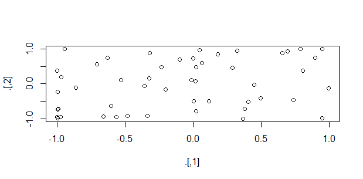
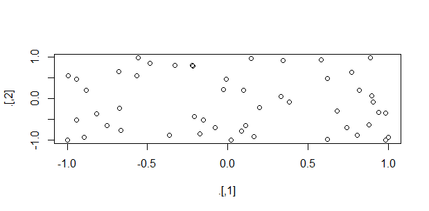

**The blog first appeared on Towards Data Science on Mar 29th, 2021. ([Link](https://towardsdatascience.com/3-lesser-known-pipe-operators-in-tidyverse-111d3411803a?sk=b21d19ce378b9cef55932e8baddc2215)**

Apart from hosting the main pipe operator %>% used by the Tidyverse community, the magrittr package in Tidyverse holds a few other pipe operators. The %>% pipe is widely used for data manipulations and is automatically loaded with Tidyverse.

The pipe operator is used to execute multiple operations that are in sequence requiring the output of the previous operation as their input argument. So, the execution starts from the left-hand side with the data as the first argument that is passed to the function on its right and so on. This way a series of data manipulation can be achieved in a single step.

So here we will discuss three other pipe operators from the magrittr package. Discuss the areas where the main pipe operator fails and how these functions can complement it.

----

## Tee pipe

The tee pipe operator `%T>%` works almost like `%>%` operator, except in situations when one of the operations in a sequence of operations does not return a value. Tee pipe operator is helpful when we have the print() or plot() functions in a series of operations that too not necessarily at the end of the sequence. As print() and plot() functions do not return any value, in that case, we can use `%T>%` operator to use the last argument value to be assigned to the operation after the print()/plot() operation. Let us look at an example, where we write a sequence of operations using the main pipe operator `%>%`.

```{R}
# sequence of operations using main pipe operator
rnorm(100) %>% 
  matrix(ncol=2) %>% 
  sin() %>% 
  plot() %>% 
  colSums()
# output
Error in colSums(.) : 'x' must be an array of at least two dimensions
```



So in the above operation, we see an error popping when executing the colSums() functions. This is because the plot() function does not return any value. To tackle this problem, we will use the tee pipe operator before the plot() function. What this will do is pass the value of sin() function as the arguments to both plot() and colSums() function, thus maintaining the flow of information.

Redoing the above example with tee pipe operator.

```{R}
# using tee pipe operator
rnorm(100) %>% 
  matrix(ncol=2) %>% 
  sin() %T>% 
  plot() %>% 
  colSums()
# output
[1]  2.372528 -4.902566
```



We can see from form the above example, with the tee pipe operator the complete sequence of operations is executed.

## Exposition pipe

Exposition pipe operator `%$%` exposes the variable names of the data frame on the left as the matching argument names in the function on the right. In some functions in base R, there is no `data =…` argument. So to reference a variable from the data frame we have to use the `$` operator as `dataframe$variable1` and so on. So in those situations, we are dealing with multiple variables then we have to repeat the process of using the $ symbol with repeating the data frame name. In order for us to avoid this, we can use the exposition pipe. Let us use the cor() and lm() functions to understand the use of exposition pipe. We will use the mtcars dataset from base R.

**Example 1 using lm() function**

using %>% operator

```{R}
mtcars %>% lm(formula = disp~mpg)
# output
Call:
lm(formula = disp ~ mpg, data = .)

Coefficients:
(Intercept)          mpg  
     580.88       -17.43
```

using %$% operator

```{R}
mtcars %$% lm(formula = disp~mpg)
# output
Call:
lm(formula = disp ~ mpg, data = .)

Coefficients:
(Intercept)          mpg  
     580.88       -17.43
```

**Example 2 using cor() function**

using %>% operator (case 1)

```{R}
mtcars %>% cor(disp,mpg)
# output
Error in cor(., disp, mpg) : invalid 'use' argument
In addition: Warning message:
In if (is.na(na.method)) stop("invalid 'use' argument") :
  the condition has length > 1 and only the first element will be used
```

using %>% operator (case 2)

```{R}
cor(mtcars$disp,mtcars$mpg)
# output
[1] -0.8475514
```

using %$% operator

```{R}
mtcars %$% cor(disp, mpg)
# output
[1] -0.8475514
```

In example 1, we see that irrespective of the type of pipe operator in use, the two operations using two different pipes work perfectly fine. But in example 2, case 2 of %>% operator and `%$%` operator works. **The key difference here lies in the type of arguments of the lm() and cor() functions.** The lm() function has data as one of the arguments but the cor() function does not. So, the %>% and `%$%` pipe operators work fine with the lm() function. For the cor() function case, since the argument is either x or y (check the documentation). So, we have to explicitly tell the x and y values to come from the mtcars data frame by defining x and y arguments as mtcars$disp and mtcars$mpg. So to avoid repetition of the mtcars data frame, we can directly use the %$% pipe operator.

## Assignment pipe

The last one of the lesser-known pipe is the assignment pipe `%<>%`. The pipe is used when the variable is assigned to itself after going through certain operations. Let us look at an example

```{R}
a <- a %>% cos() %>% sin()
# using assignment operator
a %<>% cos() %>% sin()
```

So, by using the assignment pipe operator we can remove the assignment operator `<-`.

----

## Conclusion

We explored three lesser-known pipe operators: tee, exposition, and assignment pipes, from magrittr package in Tidyverse. Further, we implemented these pipe operators in different settings to see how they complement the functioning of the main pipe operator, %>%.

The tee pipe, %T>%, is useful when a series of operations have a function that does not return any value. In the case of exposition pipe, %$%, they are handy with base R functions that do not have data as an argument. And the assignment pipe, %<>%, avoids repetition when the variable is assigned to itself after series of operations.

Thank you for reading. I hope you enjoyed the pipe functionalities. Please let me know if you have any feedback.

### References:

https://magrittr.tidyverse.org/articles/magrittr.html

https://r4ds.had.co.nz/pipes.html

https://magrittr.tidyverse.org/reference/exposition.html