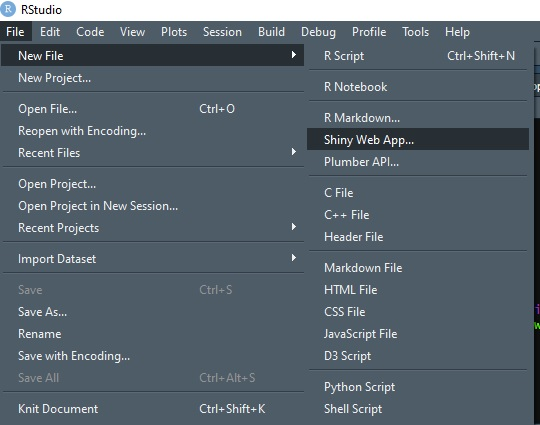
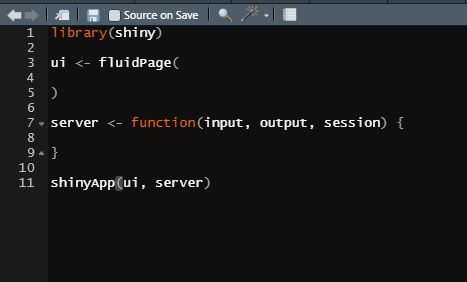
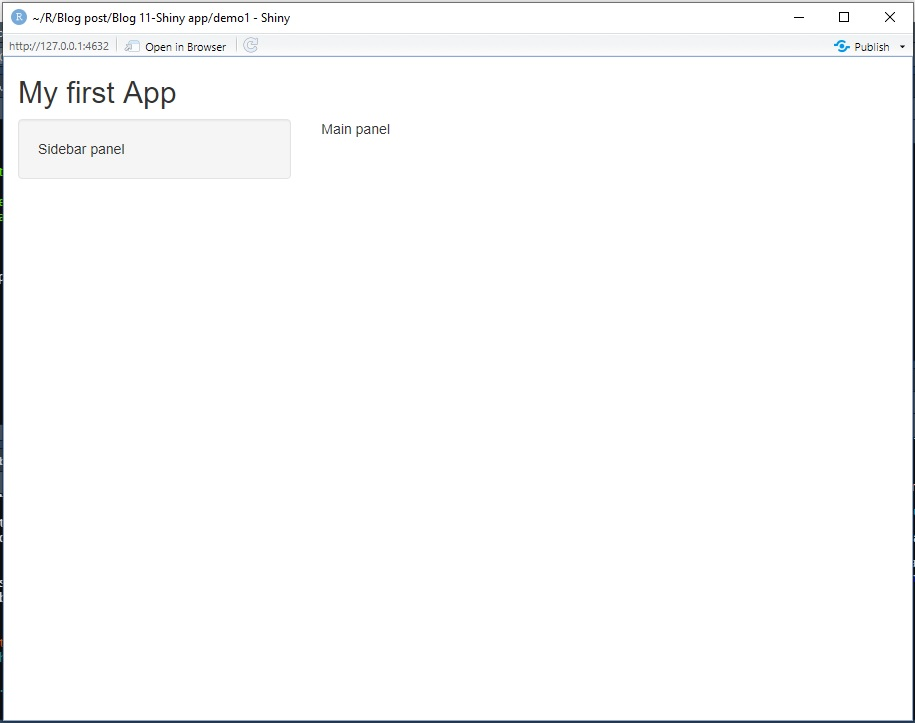
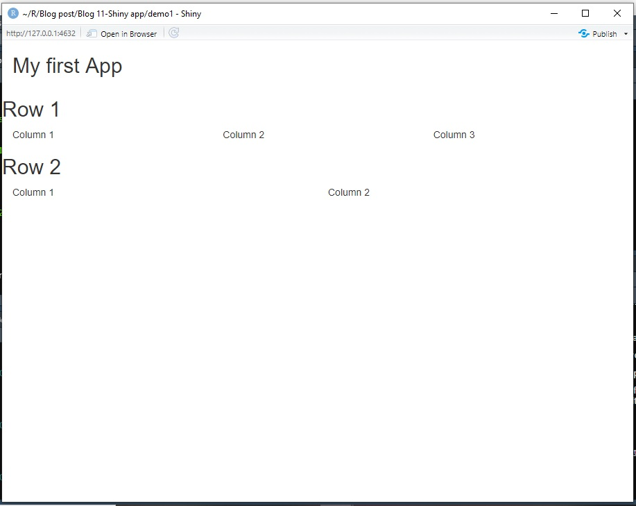
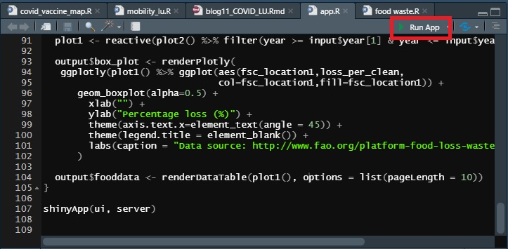
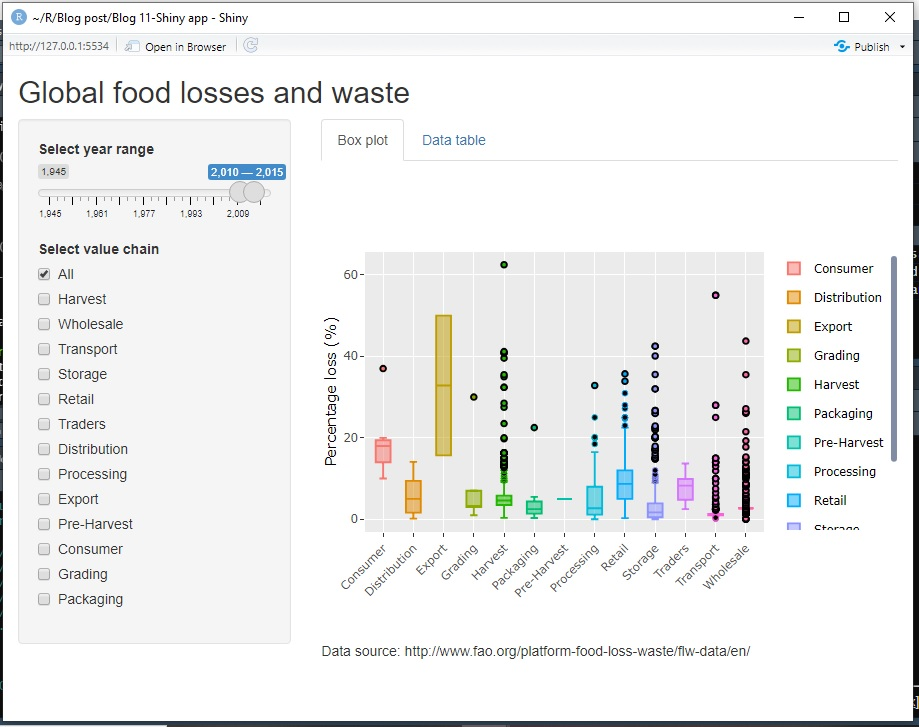
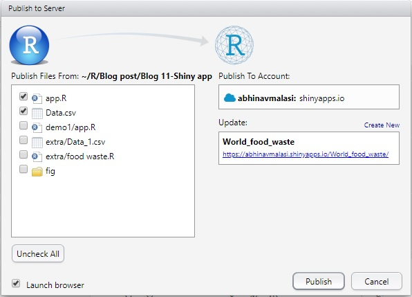

**The blog first appeared on Towards Data Science on Mar 29th, 2021. ([Link](https://towardsdatascience.com/all-you-need-to-know-to-build-your-first-shiny-app-653603fd80d9?sk=e946a37b454e803c5cf69b43e46f155c))**

Shiny is one of the powerful tools in the hand of data analysts and data scientists to develop web-based applications and interactive data visualizations. The Shiny app consists of two important functions: UI and the server function. A key feature of Shiny is the use of reactive programming to automatically update the output when changes are made in the input.

We work on the dataset of the Food and Agriculture Organization (FAO) of the United Nations to get hands-on experience of building a Shiny app from scratch ([link](https://abhinavmalasi.shinyapps.io/World_food_waste/) for the app). The article is divided into the following sections:

1. Shiny overview: get an idea of the working of Shiny and the different options available

2. Data prep: prepare data to be used for the app

3. Coding the UI

4. Connecting to the server

5. Running and publishing the app

## Shiny overview

Shiny developed by RStudio is a package with the same name. Shiny framework is made up of CSS, HTML, and Java. This gives the freedom to add functionalities to it. The apps are hosted on shinyapps.io with the help of Shiny servers.

Let us look at some examples from the Shiny RStudio [gallery](https://shiny.rstudio.com/gallery/) to get motivated. Shiny also hosts demos, layouts, and [widgets](https://shiny.rstudio.com/gallery/widget-gallery.html) for the users to get familiar with. This also helps to identify their working and choosing them for your own application.

So let’s get started….

To start building an app, we can either open a new Shiny Web App document as shown in the below figure. This will pop a new window prompting you to select Application name, Application Type (choose single file option), and set the working directory. This will open a file named app.R. This file has a default code for “Old Faithful Geyser Data” app.



The other option to go about is by opening a new R script (Ctrl+Shift+N for Windows) and saving it by the name of app.R (**this is important**) in the folder of choice. Then just type `shinyapp` in the editor and this will print the skeleton of the app as shown in the below image.



At this point, we will make sure that we have installed the shiny package on over device using the command `install.packages(“shiny”)`.

After running the `shinyapp` command, we see there are 4 things that are displayed on the editor.

1. It loads the Shiny package by calling in `library(shiny)`.

2. UI is the user interface and establishes how the user will interact with the HTML webpage.

3. The server is the backend of the app where all the interactions on the UI side are being implemented and their outcome is being sent back to UI for display.

4. `shinyapp` function is to build the app.

Before diving into the details of the functionalities offered by UI and server, let’s design the layout of the user interface. Once this is out of the way, it will be much more intuitive to build our app.


Now we can look at the functionalities offered by UI and server.

### UI controls

This part will deal with the different input and output controls the user will have access to on the panel. The panel has a width of 12. We can define a layout of our choice and customize it accordingly. The key functions to achieve this is:

**_fluidPage()_**: Makes sure the app auto-adjusts to fill the browser space.

**_titlePanel()_**: This should be by default in the code to identify what the app will be doing.

**_sidebarLayout()_**: In case you want to divide the panel with a sidebar and the main panel for displaying outputs, we use this function. The other functions that will be required with `sidebarLayout()` are `sidebarPanel()` and `mainPanel()`. All the code associated with displaying features on the panel to the end-user associated with the sidebar will be in the `sidebarPanel()` and for the main panel in the `mainPanel()` function.

```{R}
ui <- fluidPage(
  titlePanel("My first App"),
  
  sidebarLayout(
    sidebarPanel("Sidebar panel"),
    mainPanel("Main panel")
  )
)
```



**_fluidRow()_**: The other way can be to divide the panel into multiple rows. And each of these rows can have multiple columns. The multiple rows are achieved by using `fluidRow()` function multiple times and inside the `fluidRow()` function we can define the columns using `column()`.

```{R}
ui <- fluidPage(
  titlePanel("My first App"),
  
  fluidRow(
    titlePanel("Row 1"),
    column(4,"Column 1"),
    column(4,"Column 2"),
    column(4,"Column 3")
  ),
  fluidRow(
    titlePanel("Row 2"),
    column(6,"Column 1"),
    column(6,"Column 2")
  )
)
```



Now we know how to build the skeleton, we can start now filling in the blank spaces of the front end. The front end deals with the inputs and outputs provided by the Shiny app.

### Input widgets

The input widgets in the user interface can vary from being to text, numeric, or dates and can be fed in using either text fields, slider inputs, radio buttons, checkboxes, etc. All the input functions have the same first argument that is the identifying field.

> This assigned id should be unique to the function and should be of single string consisting only of letters, numbers and under scores.

The second argument is the label that is an identifier for users to understand the operation to perform. This argument is present in most of the input functions. The other arguments are more specific to the input function types and the best way is to explore the documentation for them or [visually](https://shiny.rstudio.com/gallery/widget-gallery.html).

Output functions like input functions or input widgets have a unique identifier as their first argument. The outputs can be in the form of plots, data tables, text, or R summaries.

### Server

The server function is the brain of your app and all the decisions are made here and reflected back on the user interface.

Now we have all the basic knowledge and details required for building an app with Shiny, so let us get on to it.

----

## Dataset and packages

For building the app we will be using the food loss and waste database provided by FAO. The link to the dataset is [here](http://www.fao.org/platform-food-loss-waste/flw-data/en/). The data consists of 18k plus rows and 22 columns.

We will be using the `shiny` package for building the app, `readxl` package for reading CSV files, `plotly` package for interactive data visualizations, `tidyverse` package for all the data manipulations, and `ggplot2` package for plotting.

## Data prep

Before starting to develop the app, the data needs to be prepared. For the present study, we will replicate the app developed by FAO to a certain level. We will be taking two inputs for this exercise and two outputs will be generated in the form of a plot and data table.

After installing the relevant packages, the CSV file is read using the `read_csv()` function while replacing all the empty cells with _NA_ values. Then some of the unnecessary columns have been removed for simplicity. As, we are interested in how the food losses have changed over time, so the column with year data is renamed to _year_ for simplicity.

Next, a variable _supplychain_ has been defined and assigned parameters that are of interest to us. Just plotting the percentage loss data against _fsc_location1_ revealed a typo of Harvest, which is then corrected.

A new variable, _food_new_, is defined after using the `filter()` function. Since we are concerned only with the parameters in the _supplychain_ variable, we filter the data into the newly created variable.

A function called _linebreak_ is defined to avoid repeated use of line break later in UI. A new variable called _check_box_ is defined containing all the options that will be available using `checkboxGroupInput()` function.

```{R}
library(shiny)
library(ggplot2)
library(tidyverse)
library(readxl)
library(plotly)

food <- read_csv("Data.csv", na = "")

# removing unnecessary columns
food <- food[,-c(1,3,4,8:11,20:22)]

# renaming column
names(food)[3] <- "year"

supplychain <- c("Pre-Harvest","Harvest","Grading","Storage",
                 "Transport","Traders","Processing","Packaging",
                 "Distribution","Wholesale","Retail","Consumer",
                 "Export")

# typo correction in fsc_location1
food$fsc_location1 <- ifelse(food$fsc_location1 == "Havest","Harvest",food$fsc_location1) 


#food_new <- food %>% filter(!(is.na(fsc_location1)))
food_new <- food %>% filter(fsc_location1 %in% supplychain)

# line breaks
linebreaks <- function(n){HTML(strrep(br(), n))}

check_box <- c("All",unique(food_new$fsc_location1))
{"mode":"full","isActive":false}
```

## Coding the UI

Our target is to have the user interface with a sidebar and the main panel with two tabs. We will start with the `fluidPage()` function and build everything inside it. There are three main steps:

1. Providing heading to the app using `titlePanel()` function.

2. Define the `sidebarLayout()` function and define the body parts of it consisting of `sidebarPanel()` and `mainPanel()`.

3. In the `mainPanel()` function we define the tabs using `tabPanel()` function inside the `tabsetPanel()`.

Once the skeleton is created, we can start filling in the details. We start with the sidebar panel, where the user will be interacting with the data. The two different ways of interaction considered are (1) slider inputs and (2) check box. For slider inputs we will be using the `sliderInput()` function with _id = “year”, label=“Select year range”_, setting the minimum and the maximum values of the years under consideration and the default year range. For selecting options from the check box, `checkboxGroupInput()` function will be used. This function has an identifier, _id=“valuechain”, label = “Select value chain”, check_box_ variable with all the options to be displayed to the user, and default selected value to “All”.

We now move to the `mainPanel()` function. In the `tabsetPanel()` function, we set _type=“tabs”_ to have tabs on the layout of the user interface. Next, we define two `tabPanel()` meaning two different tabs. Assign names to the tabs as the first argument, in our case they are _“Box plot”_ and _“Data table”_.

Once the input functions are defined, we move onto the output functions. The first tab will display the interactive plot using `plotlyOutput()` function and the second tab will display the data table with `dataTableOutput()` functions that generate a dynamic table with in-built search capability. The first argument of the output functions like the input functions is the identifier. The identifier values are set as _“box_plot”_ and _“fooddata”_ for plot and table outputs, respectively.

```{R}
ui <- fluidPage(
  titlePanel("Global food losses and waste"),
  
  sidebarLayout(
    sidebarPanel(
           sliderInput("year","Select year range",value = c(2010,2015),
                       min=min(food_new$year),max=max(food_new$year)),
           checkboxGroupInput("valuechain","Select value chain",check_box, selected = "All"),
    ),
    
  mainPanel(
    tabsetPanel(type="tabs",
                tabPanel("Box plot",linebreaks(3),
                         plotlyOutput("box_plot",width="100%"),linebreaks(1),
                         "Data source: http://www.fao.org/platform-food-loss-waste/flw-data/en/"),
                tabPanel("Data table",dataTableOutput("fooddata"))
                )
            )
          )
        )
{"mode":"full","isActive":false}
```

## Connecting to the server

After finishing the UI code, we will connect the UI to the server using the identifiers defined in the various input and output functions of UI. The server function has three arguments: input, output, and session. We will only be dealing with the input and output arguments.

> The session argument makes sure each time the app is opened anywhere on the web it starts a new session. This way the changes made by one user are not reflected on the session for another user.

There are two different functions defined in the server: reactive and render functions. We will go through each of them one by one to see how these functions communicate with the UI.

We will leave `reactive()` function for the end and discuss the render function first. In the UI, we defined identifiers for each input and output function. Here we will connect the UI with the server using those identifiers for the flow of information.

Looking at the box plot, we see the _output$box_plot_ variable which is assigned to the `renderPlotly()` function. The important thing to notice is that the _output$box_plot_ connects to the `plotlyOutput()` function in the UI with the help of _box_plot_ identifier. Each output function in the UI is associated with a `render()` function in the server. In this app `plotlyOutput()` function in UI is associated with `renderPlotly()` and `dataTableOutput()` is associated with `renderDataTable()` function. And the _unique identifier_ defined for each output function in UI connects it with its associated render function. This way we have connected the box plot and the data table in the UI with the server.

In the `renderDataTable()` function we have defined the `options` argument to limit the page length to 10 rows of data.

We now have our static app ready and can publish it online. What this app lacks is the changes that will be made to the slider or check box will not show in either boxplot or the data table. To build the app more dynamic we will be using `reactive()` expressions.

One key point to address here is that the dynamic nature of the app does not require a `reactive()` expression. All the input functions of the UI can directly be connected to the `render()` functions. This style may work with apps with basic functionalities but as the apps get complicated it is better to use `reactive()` expression.

The `reactive()` expression does 2 important things: it makes the app faster and efficient, and removes duplication of code, and keeps the render function clean with all the manipulations outside them. The `reactive()` expressions are assigned to variables that are called in Shiny as _variable()_. In our case, we have defined two reactive expressions _plot1_ and _plot2_. In _plot2_, condition-based filtering is done for the check box input panel in UI. And in _plot1_, the filtering is associated with the slider input. As we want both changes to be reflected in the displayed output, so, we have used _plot2()_ as the input variable for plot1. And finally, _plot1()_ is being used as the data in `render()` functions.

To reflect the changes made at the user interface, we will connect the input functions of the UI with the help of identifiers as done with the output functions. Here we will use _input$valuechain_ to reflect any changes made on the “Select value chain” options that will directly tell server to take action using the `reactive()` expressions and will be reflected both on the box plot and the data table on the user interface. Similarly, _input$year_ will reflect the changes made on the slider on the plot and the data table.

```{R}
server <- function(input, output, session) {
  
  plot2 <- reactive(if("All" %in% input$valuechain){
    food_new
  }else{food_new %>% filter(fsc_location1 %in% input$valuechain)
    }
    )
  
  plot1 <- reactive(plot2() %>% filter(year >= input$year[1] & year <= input$year[2]))
                           
  output$box_plot <- renderPlotly(
   ggplotly(plot1() %>% ggplot(aes(fsc_location1,loss_per_clean,
                               col=fsc_location1,fill=fsc_location1)) +
      geom_boxplot(alpha=0.5) +
        xlab("") + 
        ylab("Percentage loss (%)") +
        theme(axis.text.x=element_text(angle = 45)) +
        theme(legend.title = element_blank()) +
        labs(caption = "Data source: http://www.fao.org/platform-food-loss-waste/flw-data/en/"))
      )
  
  output$fooddata <- renderDataTable(food_new, options = list(pageLength = 10))
}
{"mode":"full","isActive":false}
```

## Running the app

Now you have filled in the details of UI and server. It’s time now to launch the app using the Run app option on the top right of the editor.



On pressing the run app button, the app will open up in a new window as shown below.



## Publishing the app online

If this is your first time then open a user account on ShinyApps.io. Next, install the _rsconnect package_ on R and then copy the token details from your Shiny account and run the command on the R console, this will authorize you to publish from your laptop to the ShinyApps.io webpage.

To publish the app online, press the Publish button on the top right of your app (you can refer to the above image for that). Now a window will open up, press next and then choose ShinyApps.io option. The next thing is to choose the files needed to be published and give the name to your app, this will show up in the URL.



Once you press publish, it will take a couple of minutes for the app to come online. This will be visible in the dashboard of your account on the ShinyApps website.

Link for the published app: 
https://abhinavmalasi.shinyapps.io/World_food_waste/

----

## Concluding remarks

Shiny is a powerful tool to build apps that are highly intuitive and easy to build once you get a basic understanding of its inner working. It is reactive and lazy at the same time. The changes made at the user interface are quickly reflected on the interface thus making it reactive and lazy because it will only do the minimum amount of work to update the app.

The best approach to building the app with Shiny is to first design the user interface on a piece of paper to make sure what you need. Then start adding components one by one in UI and then connect it to the server. Make sure to define unique identifiers for each function in the UI. This way when one functionality is complete, run the app to see if it works according to your need. If it is fine then add the other functionality and connect with the previous one. This way there are fewer chances to get stuck when building your app.

I hope this motivates you to build your own Shiny app. There are tons of literature and tutorials on building the Shiny app. Start from the tutorials from the [Shiny website](https://shiny.rstudio.com/tutorial/) and do get inspired by the [apps shared on the webpage](https://shiny.rstudio.com/gallery/). Then you can also read the book [Mastering Shiny](https://mastering-shiny.org/index.html), a good read to understand the thought process behind building the Shiny App by Hadley Wickham.

Do share your thoughts in the comments or the link for your app in case you build one. Till then, Happy coding!

### References:

https://mastering-shiny.org/index.html

https://datacatalog.worldbank.org/dataset/what-waste-global-database

http://www.fao.org/platform-food-loss-waste/flw-data/en/

https://shiny.rstudio.com/reference/shiny/1.5.0/

The link to the complete code for the app is [here](https://github.com/amalasi2418/Blog-post/tree/master/Blog%2012-Shiny%20app).