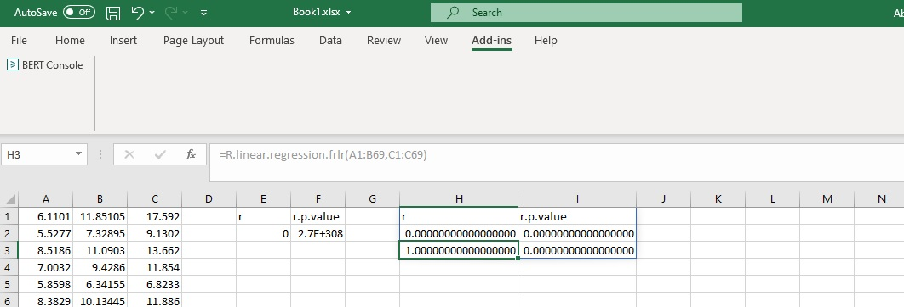
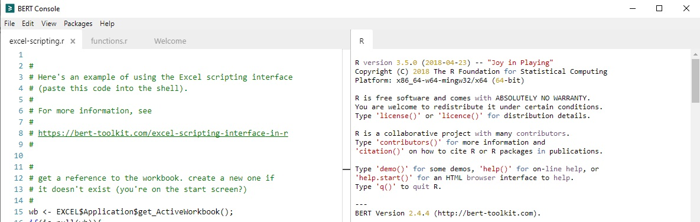
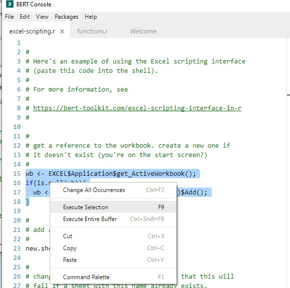
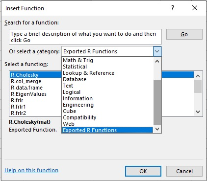
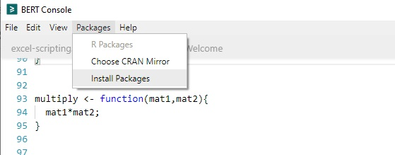
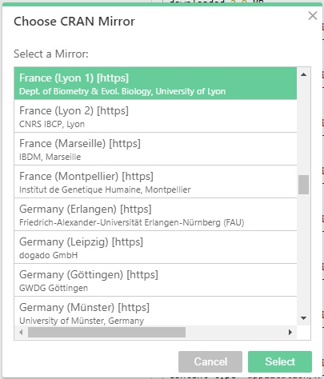
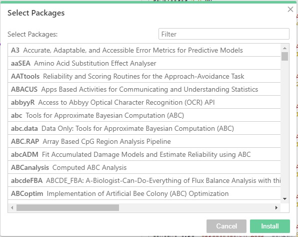

**The blog first appeared on Towards Data Science on Apr 13th, 2021. ([Link](https://towardsdatascience.com/introduction-to-basic-excel-r-toolkit-bert-de44f309e3d2?sk=bb7dfff6becd5d8caaea5e3cc56620e6))**

Excel has been the go-to data analytics tool for businesses for the last three decades. Excel provides built-in tools to conduct statistical analysis, creating budgets, forecasting, dashboards, data plotting, etc. And then there are add-ins to fill in the analytical gap or improve performance.

For me, Excel had been a great tool, but I had two issues using it: first being the occasional freezing of Excel when working with large data files (> 50MB), and second, the poor quality of default plots generated which required a lot of polishing. And these were the reasons to transition to MATLAB (licensed software) and then to R (open source).

I am not here to convince people to leave Excel and transition to R or any programming language, but to provide a solution for those Excel users to leverage the **_Basic Excel R Toolkit (BERT)_** add-in. As the popular saying goes in data science professional circles:

> The key to data science is to leveraging different tools to solve the problem rather than mastering one.

## What is BERT?

_Basic Excel R Toolkit or BERT_ is an add-in to run built-in R functions from the Excel spreadsheet cells. BERT is free! BERT provides two features:

1. User-defined R functions for Excel: The user can define their own functions in R and BERT will convert those functions into Excel functions.

2. Controlling Excel from R: The user can interact in real time with the Excel spreadsheet using R.

The other advantage of BERT is that it is compatible with VBA.

## Installing BERT

So, to get started, first we need to install the add-in. The file can be downloaded from [here](https://bert-toolkit.com/download-bert). The **_current limitation_** with BERT is that it is available only to Windows users with Excel versions after 2003 and for 64-bit Windows.

Once the installation is complete, the BERT plugin will be available in the Add-ins tab of Excel, and the BERT console will open up. If the console does not open then click the console option in the Add-ins to open the BERT console.



The BERT console consists of two halves. The left half has the editor with three open tabs, and the right half has the R console.



The tab _“excel-scripting.r”_ on the BERT console is for interacting with Excel in real time. You can try running the commands on the _excel-scripting.r_ tab by selecting the chunk of code and pressing **_F9_** to execute or use **_Ctrl+Shift+F9_** to execute the complete code.



Running the entire chunk of code from this tab will create the new sheet in Excel with the name “R data set” only if a sheet with the same name does not exist. More details on this can be read in the documentation provided [here](https://bert-toolkit.com/excel-scripting-interface-in-r).

The second tab _“functions.r”_ is of interest to me and I will try to go into some detail to show different functionalities that we can leverage.

## Using R functions in Excel

BERT has a predefined way of writing functions similar to R.

```
function_name <- function(arg1,arg2,...){
...
}
```

There are two default functions defined when BERT is installed. They are TestAdd and EigenValues. These functions are accessible as R.function_name. So, in Excel, they can be accessed by typing in R.TestAdd and R.EigenValues.

To access these functions let's first open the Insert function dialogue box by pressing **_Shift+F3_**. Add from the **Category** drop-down menu choose **_Exported R Functions_**.



### Writing functions

Now we have a fair idea of how to load the R functions so let's get some hands-on experience.

Here I will define functions based on some basic R functions, functions to create plots, and functions for linear regression. Once the functions have been written, save them in the default setting for them to be available for use in Excel.

**_Basic R functions_**: Here I have defined four functions to use the R %in% operator, to combine vectors using rbind() or cbind() functions, and to create a data frame by combining 2 vectors. More pre-defined functions can be found [here](https://bert-toolkit.com/bert-example-functions).

```{R}
# matching vectors using %in%
match <- function(vec1,vec2){
vec1 %in% vec2
}

# combine 2 matrices wrt rows
row_combine <- function(mat1, mat2){
rbind(mat1,mat2)
}

# combine 2 matrices wrt columns
col_combine <- function(mat1, mat2){
cbind(mat1,mat2)
}

# create data frame
data.frame <- function(x,y){
as.data.frame(cbind(x,y))
}
```


**_Base plots of R_**: Next, I defined a function to use the base plotting of R. Here are two functions defined for plotting histogram and scatter plots.

Code for plotting histogram:

```{R}
graph.histogram <- function(data, main="Histogram", xlabel="Data"){

# passing cell=T means "use the cell address as a unique
# identifier". otherwise, use the name parameter to identify
# the target shape.

BERT.graphics.device(cell=T);

# scrub the data (slightly) then generate a histogram

x <- unlist( as.numeric( data ));

hist( x, xlab=xlabel, main=main, col="pink", breaks=13, font.main=1);

# we're done with the graphics device; we can shut it off.
# this isn't strictly necessary, but there's a limit of 63
# active devices so it's a good idea.

dev.off();

# returning TRUE indicates everything succeeded.
T

}
```

Code for plotting scatter plot:

```{R}
graph.scatter <- function(x,y,main="Scatter plot"){

BERT.graphics.device(cell=T);

plot(x,y)

dev.off();

}
```


The interesting thing about these functions is the changes in the input values are reflected in real-time in the plots. Apart from that, the quality of the plots is far superior to the default plots of Excel as can be seen in the below image.

**_Installing packages_**: Here for demonstration purposes, I have used the in-built function draw.map(). The function draws the world map and for that, it requires **_maps package_**.

```{R}
draw.map <- function( countries, values, title ){

library(maps);

BERT.graphics.device(cell=T);

# allow nulls in countries; map to values and ensure zeros.
c2 <- unlist(countries[!is.na(countries)]);
values <- as.numeric(values);
values[is.na(values)] <- 0;
v2 <- unlist(values[!is.na(countries)]);

# for colors, reduce to a color space of 32 (?) levels. scale values.
n <- 32;
scaled.values <- round((1-((v2-min(v2))/(max(v2) - min(v2))))*(n-1))+1;
heatcolors <- heat.colors(n);
margins = c(0, 0, 0, 0);
if( !missing(title)){ margins[3] <- .6; }

# fill doesn't work properly (or at least as one would expect)
# when a country has multiple polygons, so do this in separate passes...
# 1: space out the map
par(mai=margins);
map("world", c2, fill=F, lty=0);

# 2: fill in countries
sapply( c2, function(country){
map( "world", country, fill=T, lty=0, add=T,
col=heatcolors[scaled.values[[which(c2==country)]]] );
});

# 3: draw lines on top
map("world", c2, fill=F, col="#cccccc", add=T );
# add title
if(!missing(title)){ title( main=title, font.main=1 ); }

dev.off();

T;
}
```

To install a package in BERT, we have to choose the Packages tab on the BERT console -> Install packages.



This will prompt you to choose the CRAN mirror



and after that, you can select your package to install.



After the package is installed, the defined function is ready for use.


## Final remarks

BERT is a very powerful add-in that can benefit the Excel user community. The above demonstrations clearly highlight the fact that the majority of the R functionalities (only CRAN packages are available) if not all are available via BERT.

The key advantages that I saw in using BERT are:

1. Clear compatibility of R functions

2. Easy to customize or build your own functions

3. Superior quality of plots

4. Real-time changes reflecting on the plots

The disadvantages with BERT:

1. The changes in the plot do not reflect in PowerPoint as with default Excel plots.

Other than the above-mentioned disadvantage, I currently do not see why BERT cannot be a good tool to use.

If you are an Excel user then do try BERT and see if it adds value to your work.

### Reference:

https://bert-toolkit.com/