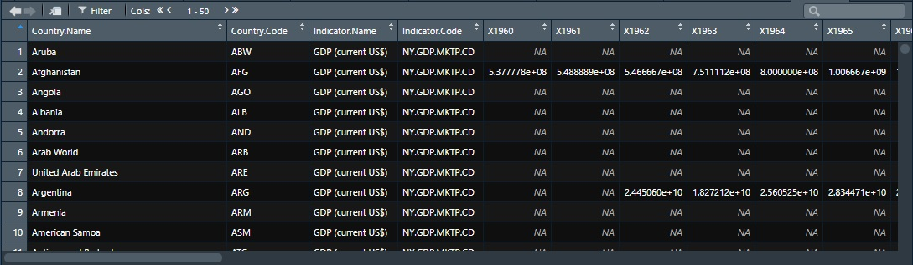
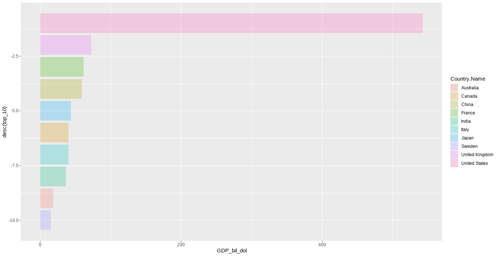
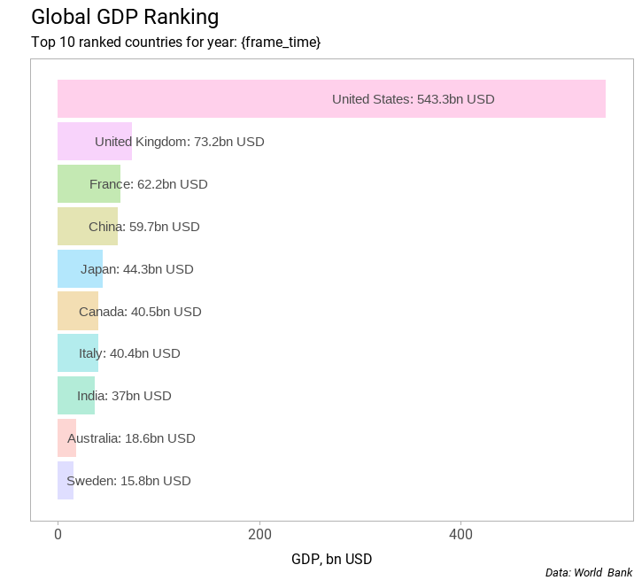
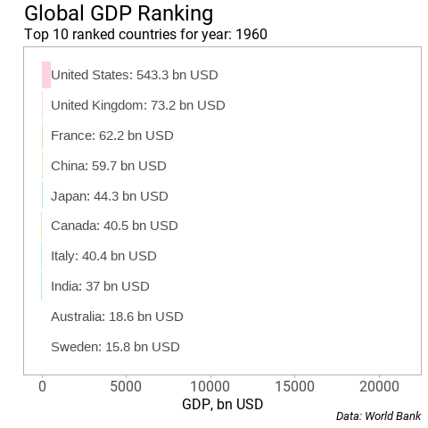
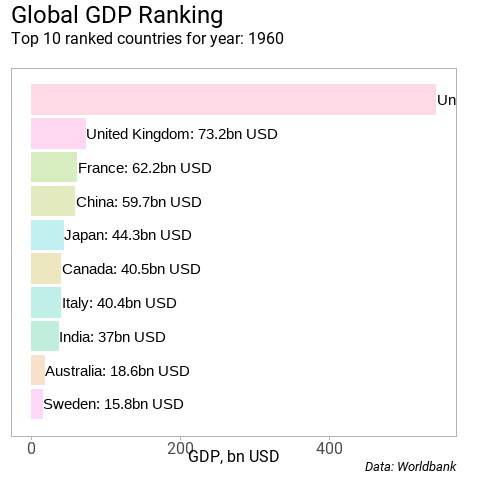

**The blog first appeared on Towards Data Science on Jun 06th, 2021. ([Link](https://towardsdatascience.com/hands-on-tutorial-f2ee5dc4d0a8?sk=c3a7c1c16eeefa0c8bdee88ecf888723))**

Data visualizations in the form of plot and infographics are the way to convey stories. The stories are appealing to the masses if they have substance to them and are self-explanatory. The reason infographics or presentations are more popular than a mere plot because they convey a story and are self-sufficient. A plot narrates only a part of the story. To make plots more meaningful, one can either stack series of plots faceted together or stack a series of plots to create an animation. A great example of this is the animation created by [Hans Rosling](https://www.youtube.com/watch?v=jbkSRLYSojo) in which he compares life expectancy against income.

Here, I will be creating a bar chart race using the GDP expenditure data for 10 top countries between 1960–2019. The focus of this tutorial is:

1. Use the GDP expenditure data to create an animation of the top 10 countries’ GDP for each fiscal year from 1960 till 2019.

2. Clearly show how the quality of the plot can be improved over the default `ggplot` plot.

3. Provide steps in creating two different styles of race bar charts.

We will be creating two different styles of bar chart race, one with a fixed axis and the other with a dynamic axis. The complete code can be found in my [Github repository](https://github.com/amalasi2418/Blog-post/tree/master/Blog%2014-animate).

----

The inspiration for creating the bar chart race animation is from the [Twitter post of John Burn-Murdoch](https://twitter.com/jburnmurdoch/status/1107552367795412992?lang=en) where he animates the top 10 most populous cities of the world. In this tutorial, the bar chart race animation is recreated using the world [GDP data](https://data.worldbank.org/indicator/NY.GDP.MKTP.CD?most_recent_year_desc=false) from the World Bank.

## Data preparation

If you open the data file, you will notice the relevant columns starts from row 5. So you need to get rid of the first four lines. Either we can delete them manually, or we can write an argument while reading the CSV file to make the computer do it for you. Let us take the latter path. To read CSV files, load the `readr` package, and use the function `read.csv()`. The `skip = 4` argument skips the first four rows of the file. The data consists of country names, country codes, and GDP values. To make sure the country names and country code columns are of the string class, we will set the argument as `stringsAsFactors = False`.

```{R}
gdp <- read.csv("C:/Users/amalasi/Documents/R/Blog post/Blog 14-animate/GDP/GDP.csv", 
                skip = 4,stringsAsFactors = F)
```

On previewing the `gdp` variable, we notice that some columns are redundant and can be removed. As we are interested in creating the animation using the time index, we need to rearrange the current data table from wide to long to have additional columns with values of year and GDP. Using the `gather()` function from the `tidyr` package a new variable `gdp_long` is defined with two new columns named _Year_ and _GDP_dollar_ (the GDP values are in dollars).



```{r}
# removing reduncdant columns
gdp %<>% select(-c(2:4,65,66))

# converting the wide table to long
gdp_long <- gdp %>% gather(Year,GDP_dollar,c(2:61))
```

After transforming the data to a long format, the _Year_ column values show **_X_** before the year values. To get rid of the **_X_**, we will use the `gsub()` function. We call the `gsub()` function, and the first argument is the string we want to replace, the second argument is the string we want it to replace with, and the third is the data on which the action takes place. We convert the _Year_ column to an integer using `as.integer()` function. This conversion to an integer variable will come in handy later when animating.

```{R}
gdp_long$Year <- as.integer(gsub("X","",gdp_long$Year))
```

The last cleaning step is to remove few specific values from the _Country.Name_ column. There are a few values in the _Country.Name_ column representing a cluster of countries or regions like the Arab World, Caribbean small states, Central Europe and the Baltics, Channel Islands, etc. The best possible approach is to use the standard ISO codes of the countries to remove the unwanted data. As all the countries are assigned an ISO code, we can use it to our advantage. For this, we will use the `countrycode()` function from the `countrycode` package. A new variable called Code is defined using `mutate()` function. To convert the country names to ISO codes, the first argument is the data we want to work on. For the current case, the data sent in is the country names so the second argument of the `countrycode()` will be set as `country.name` and the third argument as `iso3c`. So, what this does is converts the country names to 3 letter country codes.

```{R}
gdp_long %>% mutate(Code = countrycode(gdp_long$Country.Name,
                                            "country.name","iso3c"))
```

All the unnecessary regions or country clusters do not have ISO codes and will be assigned `NA` values. We can now filter the data to remove the unnecessary data.

```{R}
gdp_long %>% mutate(Code = countrycode(gdp_long$Country.Name,
                                            "country.name","iso3c")) %>% 
  filter(!is.na(Code))
```

For the animation, we need to arrange the data in a certain way. We will start with grouping the data Year wise and rank them in descending order of the GDP expenditure. The negative sign in `rank()` function arranges the _GDP_dollar_ vales in descending order. We define a new variable to which the converted GDP values to billion-dollar by dividing the GDP values by 10⁹ is assigned. The last step is filtering the data to extract the top 10 countries with the highest GDP expenditure and ungrouping the data.

```{R}
c <- gdp_long %>% mutate(Code = countrycode(gdp_long$Country.Name,
                                            "country.name","iso3c")) %>% 
  filter(!is.na(Code)) %>%
  group_by(Year) %>% 
  mutate(top_10 = rank(-GDP_dollar), GDP_bil_dol = GDP_dollar/1e9) %>% 
  group_by(Country.Name) %>% 
  filter(top_10 <= 10) %>% 
  ungroup()
```

## Static bar charts

After the data preparation, let us create a static plot to make sure we have everything we want in our plot. To create a frame of the animation, filter the data to Year = 1960 to plot the top 10 countries with GDP expenditure.

```{R}
c %>% filter(Year==1960) %>% 
  ggplot(aes(desc(top_10),GDP_bil_dol, fill = Country.Name)) +
  geom_bar(stat = "identity", alpha = 0.3) +
  coord_flip()
```



So, we have a bar plot requiring polishing. Few things we can do to improve the appearance of the plot is to remove the gray background and the legend. Add descriptive text to make it self-explanatory and increase the font size.

The first thing we can do is change the theme of `ggplot` using the ~ function. If interested in knowing more about `theme()` function in R then check out this [article](https://towardsdatascience.com/master-data-visualization-with-ggplot2-theme-customization-8421695d24e2?sk=d1592d6b38d7412cf47afedc0912303a).

```{R}
geom_text(aes(y=ifelse(GDP_bil_dol<1000, 500,GDP_bil_dol/2),
                label = paste0(Country.Name,": ",round(GDP_bil_dol,1)," bn USD"), 
                hjust = 0),color = "gray30") +
  theme(panel.grid = element_blank(),
        legend.position = "none",
        axis.title = element_text(size = 12),
        axis.title.x = element_text(vjust = -1.5),
        axis.text.y = element_blank(),
        axis.ticks.y = element_blank(),
        axis.text.x = element_text(family = "Roboto", size = 12),
        plot.subtitle = element_text(size = 12),
        plot.caption = element_text(size = 10, face = "italic")
        ) + 
  labs(x="", y="GDP, bn USD", caption = " Data: World Bank") +
  ggtitle("Global GDP Ranking", subtitle = "Top 10 ranked countries for year: {frame_time}")
```



What we did is filtered the data and plotted the top 10 GDP values for the year 1960. Here is the list of the layers added to the `ggplot` and the idea behind using them.

**geom_text()** is useful when adding text in the plot panel. To display GDP values alongside the bars the y-coordinates are defined using the `ifelse` statement, as the length of the text can vary. I wanted to make sure the text remains within the plot boundaries for large values of GDP. For this, I defined a cutoff GDP value of 1000. For GDP values below 1000, start printing the text at 500 value otherwise at the mid-point of current GDP value. Then the _label_ is defined using the `paste0()` function as I wanted to merge the running variables with pre-defined text. Next, I used `hjust = 0` to make sure the text does not go outside the plot area from the left margin of the plot. Lastly, the `color = "gray30"` is chosen to match it with the color of axis ticks.

**theme()**: using the theme function we take care of the font size, font types, colors, if we want to have grid lines, major and minor ticks, legends, adjusting text, etc.

**labs()**: All the axis titles and caption are defined using this function.

**ggtitle()**: I have used this function to define the title and subtitle for the plot. The _{frame_time}_ is from the `gganimate` package and will display the running time index.

After finalizing the aesthetics of the plot, we assign the complete plotting expression to an object `xx`. Once this step is done, we can animate the plot.

```{R}
xx <- c %>% group_by(Year) %>% 
  ggplot(aes(y = desc(top_10),x = GDP_bil_dol)) +
  geom_barh(stat = "identity", aes(fill = Country.Name),alpha = 0.3) +
  geom_text(aes(x=GDP_bil_dol/2,label = paste0(Country.Name,": ",round(GDP_bil_dol,1)," bn USD"), 
                hjust=0), color = "gray30") +
  theme(panel.grid = element_blank(),
        legend.position = "none",
        axis.title = element_text(size = 12),
        axis.title.x = element_text(vjust=-1.5),
        axis.text.y = element_blank(),
        axis.ticks.y = element_blank(),
        axis.text.x = element_text(family = "Roboto", size = 12),
        plot.subtitle = element_text(size = 12),
        plot.caption = element_text(size = 10, face = "italic")
  ) + 
  labs(y="", x="GDP, bn USD") +
  ggtitle("Global GDP Ranking", subtitle = "Top 10 ranked countries for year: {frame_time}") + labs(caption = " Data: World Bank")
```

## Animating the bar chart

We have two possibilities to animate the bar chart. In the first case, we keep the axis fixed and let the bar grow over time. For this, we need to load the `gganimate` package and start adding layers to the ggplot function. By adding the `transition_time()` layer, the ggplot function knows which variable be the running index. The argument for the `transition_time()` is the variable that defines the time index, in our case, it is the _Year_ column. We define a new object `p2` and assign it the updated arguments for animating.

```{R}
p2 <- xx + transition_time(Year)
```

Once the transition time is defined, we can create a gif animation using the `animate()` function.



The second case is when the axis with GDP values is auto-adjusting with time evolution. We add another layer to the code for the first case with the fixed axis. The layer consists of the `view_follow()` function from the `gganimate` package. The `view_follow()` function lets you define which axis needs to be dynamic. The default values are set so that both the axis are dynamic. To set only one axis dynamic, we can set the argument as `fixed_x = TRUE`. This way `view_follow()` function knows the x-axis is fixed. Similarly, we can set for the y-axis by setting the argument `fixed_y = TRUE`. We can set the starting range for the dynamic axis by using the argument `fixed_x = c(0, NA)` (similarly for the y-axis). The first value in the vector can be any starting value depending on the data but the final value needs to be `NA`. One can also use the `ease_aes()` function to define how the values change when running the animation.

```{R}
p2 <- xx + transition_time(Year) + 
  # ease_aes('linear', interval = 0.1) +
  view_follow(fixed_x = c(0,NA), fixed_y = TRUE)
```

When creating gifs, we can provide arguments in the `animate()` function to define `nframes` or `fps`. `nframes` are the number of frames (default is 100) and `fps` is the frame rate displaying frames per second (default is 10 fps).

```{R}
# if using magick for saving gif files
anim <- animate(p2, nframes = 240, fps = 10)

# using gganimate for saving gif files
animate(p2, nframes = 240, fps = 10)
```

On running the modified code with view_follow(), we see that the data on the axis ticks is flickering, and the axis title is switching places as seen below.



> _The issue arises as the `view_follow()` function is not compatible with `coord_flip()`. The [fix for this](https://github.com/thomasp85/gganimate/issues/336) is not to use `coord_flip()` and manually switch the x- and y-axis in the aesthetics of ggplot or use `geom_barh()` from the `ggstance()` package._

After fixing the issue the animation gif should look like this.


## Saving the animation

The generated gif file can be saved either by using the `magick` package or the `gganimate` package.

```{r class.source="bg-danger"}
# using magick package
magick::image_write(anim, path="myanimation.gif")

# using gganimate package
anim_save("myanimation.gif")
```
Here is the complete code for creating both animation gifs.

## Conclusion

In the above tutorial we achieved:

1. Creating gif files from the GDP data.

2. Improved the plot quality from the default.

3. Showed two different ways to create gif files for the same data.

4. Found a work around on limitations of using `view_follow()` and `coord_flip()` together.

I hope you liked this short tutorial on creating an animated bar chart. The best way around is to explore gganimate to test the limits of animation that can be created using R.

Link to the [Github repository](https://github.com/amalasi2418/Blog-post/tree/master/Blog%2014-animate).