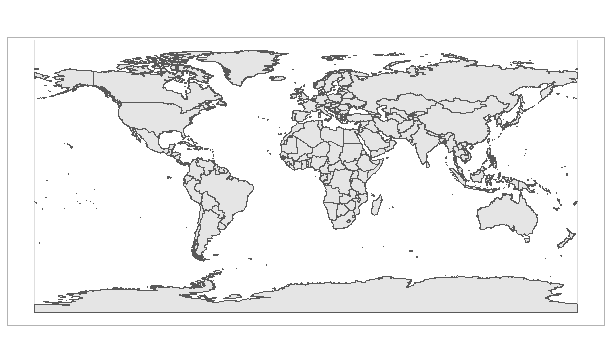
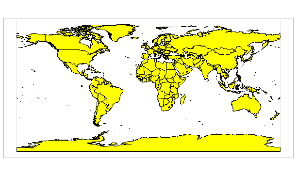
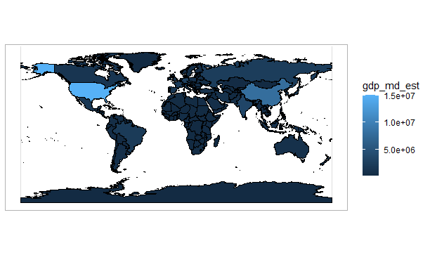
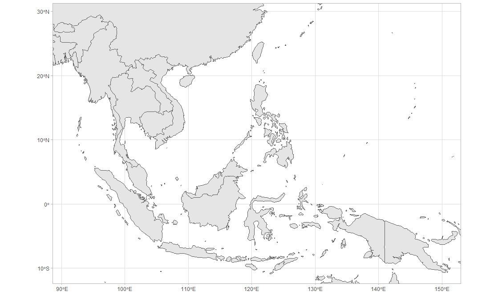
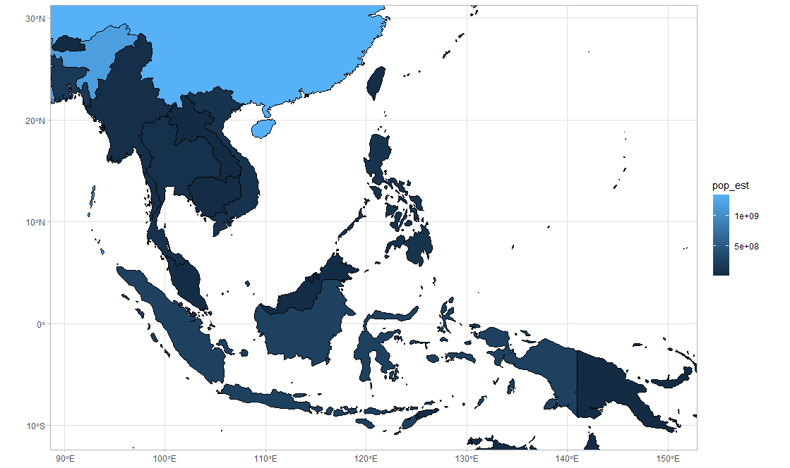
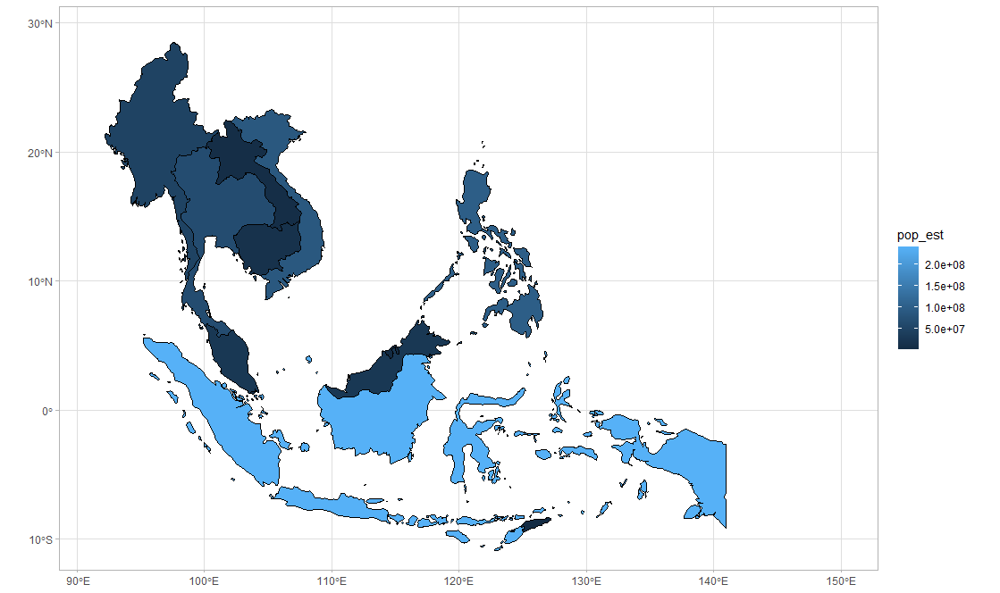
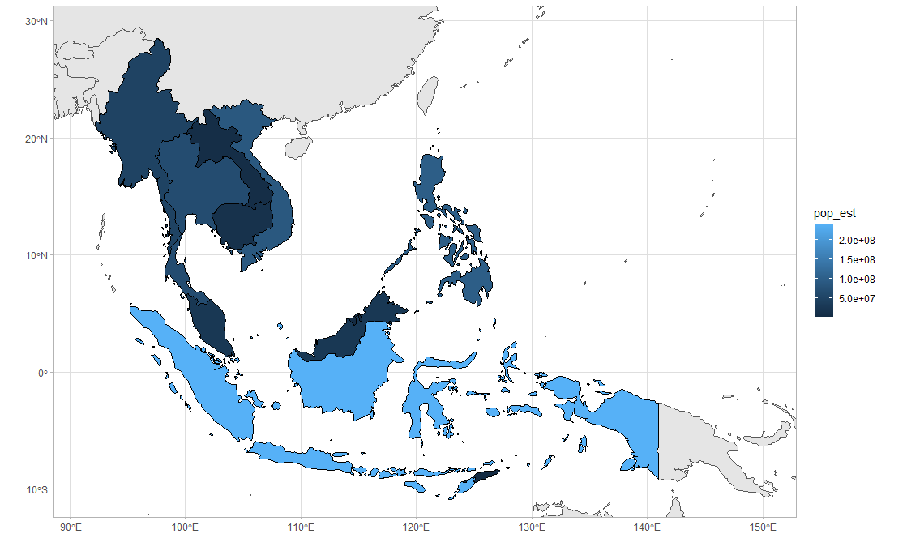
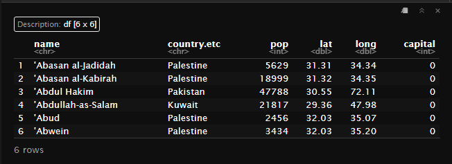
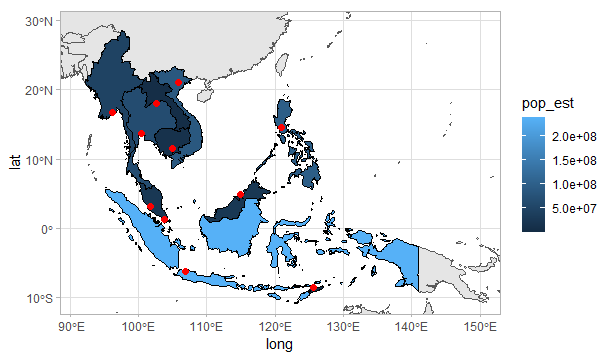
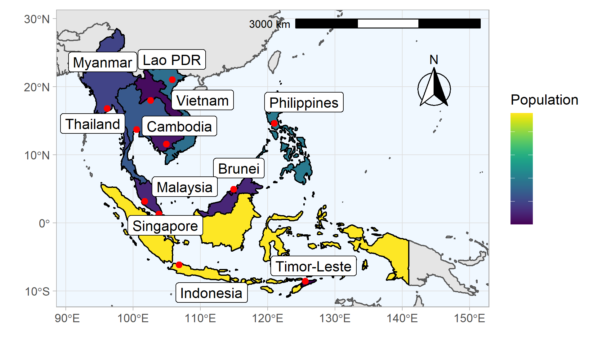

**The blog first appeared on Geek Culture on June 29th, 2021. ([Link](https://medium.com/geekculture/how-to-map-data-with-r-8333110dff5b?sk=4dbc96e52729194aa0a87020635b917d))**

Maps are one of the widely read and understood visualizations that keep getting more and more traction. Since the start of the pandemic, the maps caught my attention again after a gap of more than two decades. The internet was flooded with visualizations depicting the spread of the virus, and one such visualization or rather a dashboard attracted me was from John Hopkins University. By adding the map with the various plots, the dashboard painted a different picture. The data was more clear and informative than just looking at the daily rise in the number of cases. The map helped in comparing globally or locally, where the cases were rising.

This was the reason, I so much wanted to try my hands on creating maps with R and finally found the time to do it. Here is John Hopkin’s dashboard in case you haven't seen it before:

https://coronavirus.jhu.edu/map.html

In this tutorial, we will learn to work with maps using the `ggplot2()` package. The objectives for this tutorial are:

1. Loading the world map.

2. Narrowing down on a certain region.

3. Adding points on the map.

4. Adding labels, scale bar, and compass.

So let us dive in.

----

We will start with loading the packages. To access the world maps, we can load the `rnaturalearth` package. The limitation of the package is that it doesn't contain data for creating high-resolution maps. To create high-resolution maps try loading the `rnaturalearthhires` package. Further, we will use the `sf` package to work with the spatial dataset.

```{r}
# package for data manipulation
library(tidyverse)

# packages for plotting
library(ggplot2)
library(ggrepel)

# package for working with spatial data
# sf has functions compatible with ggplot
library(sf)

# package for loading world map
library(rnaturalearth)
library(rnaturalearthhires)
```

As maps are best visualized when having either light or dark backgrounds. We will set the ggplot theme here to `theme_light()`.

```{r}
theme_set(theme_light())
```

## Loading the world map

To load the boundaries of the nations, we will use the `ne_countries()` function from the `rnaturalearth` library. There are two arguments in this function that are useful. One is for defining the map resolution using `scale` argument and the other is for defining the `returnclass`. The `scale` argument can have three values 110, 50, and 10 for small, medium, and large. When defining `scale=“large”`, the `rnaturalearthhires` package needs to be loaded. The default for `returnclass` argument is `sp`, and it can take either `sp` or `sf` as arguments. Both `sp` and `sf` deals with spatial coordinate systems in R.

We define an object named world that will contain the coordinates of the countries.

```{r}
world <- ne_countries(scale = "medium", returnclass = "sf")
```

We can now look at the `world` object and see its class and the column names.

```{r}
class(world)

# OUTPUT
[1] "sf"         "data.frame"
```

The class of object _world_ suggests it is of type `sf` and `data.frame`.

On using the `names()` function, we see the _world_ consists of 64 columns.

```{r}
names(world)

#OUTPUT
[1] "scalerank"  "featurecla" "labelrank"  "sovereignt" "sov_a3"    
[6] "adm0_dif"   "level"      "type"       "admin"      "adm0_a3"   
[11] "geou_dif"   "geounit"    "gu_a3"      "su_dif"     "subunit"   
[16] "su_a3"      "brk_diff"   "name"       "name_long"  "brk_a3"    
[21] "brk_name"   "brk_group"  "abbrev"     "postal"     "formal_en" 
[26] "formal_fr"  "note_adm0"  "note_brk"   "name_sort"  "name_alt"  
[31] "mapcolor7"  "mapcolor8"  "mapcolor9"  "mapcolor13" "pop_est"   
[36] "gdp_md_est" "pop_year"   "lastcensus" "gdp_year"   "economy"   
[41] "income_grp" "wikipedia"  "fips_10"    "iso_a2"     "iso_a3"    
[46] "iso_n3"     "un_a3"      "wb_a2"      "wb_a3"      "woe_id"    
[51] "adm0_a3_is" "adm0_a3_us" "adm0_a3_un" "adm0_a3_wb" "continent" 
[56] "region_un"  "subregion"  "region_wb"  "name_len"   "long_len"  
[61] "abbrev_len" "tiny"       "homepart"   "geometry"
```

If you look at the column names, the last column named _geometry_ contains the spatial data for the countries.

Now we have loaded the data for the world map, let us visualize it. This can be done using the `ggplot()` and `geom_sf()` functions.

```{r}
world %>% ggplot() + geom_sf()
```

Using the above command, the ggplot only selects the data column that has the coordinates for the countries and the `sf` package is for spatial data.



Like the normal `geom_*()` functions of ggplot, we can also define aesthetics for `geom_sf()`. We can add color to the map using the `aes()` function.

```{r}
world %>% ggplot() + 
  geom_sf(color = "black", fill = "yellow")
```



Or we can fill the map by assigning the fill argument inside the aesthetics. For demonstration purposes, we will color code the map using the GDP data in the object named _world_.

```{r}
world %>% ggplot() + 
  geom_sf(color = "black", aes(fill = gdp_md_est))
```



Interested in visualizing the GDP expenditure in the last 5 decades for the top 10 ranked countries of the world. Then you can check this article:

The key difference between the above two plots in using the `fill` argument with `geom_sf()` is when using the values from the _world_ object, the `fill` argument needs to be defined within the aesthetics of `geom_sf()`.

## Narrowing down on a certain region

Now we can load the world map with R. The next step is to focus on a certain region of the world. For demonstration purposes, we will focus on the South-East Asia (SE Asia) region.

By adding the `coord_sf()` layer with the arguments _xlim_ and _ylim_, we can zoom into any part of the world. By googling, the coordinates of the SE Asia region were found and used for creating the map. `expand = FALSE` argument makes sure the map boundaries are cut off at the defined coordinates and no buffer space is provided. Try running the below command without the _expand_ argument and notice the difference.

```{R}
world %>% ggplot() +
  geom_sf() +
  coord_sf(xlim = c(88.594382881345, 152.93774260658), ylim =  c(31.29186472309,-12.375471986864), expand = FALSE)
```



Let us now fill in the countries of SE Asia region according to their populations. The population data is also in the _world_ object under the column name _pop_est_.



One issue with the above map is that it highlights all the regions within the map boundaries and doesn't consider if the region is from SE Asia or not. We have to modify our approach to correct the above map. According to the Wikipedia article on SE Asia, the region has [11 countries](https://en.wikipedia.org/wiki/Southeast_Asia#Political_divisions).

What we missed here was to filter only the countries in the SE Asia region as the code is not intuitive to do it automatically. This time we will filter the data using the _subregion_ column of the _world_. There are two approaches to plotting the SE Asia region data. Depending on the user’s preference any one of the methods can be adopted.

The **first method** is the floating map where only the SE Asia region is highlighted.

```{R}
world %>% filter(subregion == "South-Eastern Asia") %>% 
  select(name,geometry,pop_est) %>%
  ggplot() +
  geom_sf(color="black", aes(fill = pop_est)) +
  coord_sf(xlim = c(88.594382881345, 152.93774260658), 
           ylim = c(31.29186472309,-12.375471986864), expand = FALSE)
```



The **second method** is to retain the bordering countries. To do that, we define a new object called _SE_Asia_.

```{R}
SE_Asia <- world %>% filter(subregion == "South-Eastern Asia") %>% 
  select(name,subunit,geometry,pop_est)
```

One thing to notice here is that we added the `geom_sf()` layer two times. The first time we loaded the map of the countries within the coordinate ranges defined in `coord_sf()` function. With the help of the second `geom_sf()` layer, we highlighted the SE Asia region.

```{R}
(SEA_map <- world %>% 
  ggplot() +
  geom_sf() +
  geom_sf(data=SE_Asia, aes(fill=pop_est),color="black") +
  coord_sf(xlim = c(88.594382881345, 152.93774260658), 
           ylim = c(31.29186472309,-12.375471986864), expand = FALSE))
```



## Adding points on the map

The next step will be to add the capital cities of the SE Asian countries. We are only interested in adding capitals as points on the map and not as regions. In reality, the cities have their own boundaries and area.

The `rnaturalearth` package does not have the data for cities but we can load the `maps` package. The `maps` package contains data for the world cities under the _world.cities_ dataset.

```{r}
# loading the maps package
library(maps)
```

We can use `head()` function to get the idea of _world.cities_ dataset and `class()` function to get the idea of data type. For the _world.cities_ dataset, the coordinates are defined as latitude and longitude values in two different columns. The cities which are the country capitals are assigned _1_ in the _capital_ column.

```{r}
# Getting the idea of dataset
head(world.cities)
```



We see the _world.cities_ class is not `sf` as seen for the object, _world_, we defined earlier.

```{r}
class(world.cities)

# OUTPUT
[1] "data.frame"
```

We will extract the capitals of the SE Asian countries and assign the data to a new object called _capital_. We will filter the countries using the `%in%` function to check the overlapping countries and filter only the cities for which _capital_ is assigned the value of _1_.

```{r}
# filtering the capitals of SE Asia
capital <- world.cities %>% 
  filter(country.etc %in% SE_Asia$subunit, capital == 1)
```

Next, we can plot the capitals using the `geom_point`. When using `geom_point`, we are using the longitude and latitude values for plotting the capitals.

```{r}
SEA_map + 
  geom_point(data=capital, aes(long, lat), size = 2, color="red")
```

The second approach is to convert the `capital` data frame to `sf` object. We can use the `st_as_sf()` function to convert the coordinates to `sf` object. As arguments, we have to identify which columns are the coordinates that need to be converted and also the coordinate reference system or `crs`. `crs = 4326` is the most commonly used code by organizations that provide GIS data.

```{r}
# converting to sf object
capital <- st_as_sf(capital, coords = c("long", "lat"), crs = 4326)
(SE_Asia_map <- world %>% 
  ggplot() +
  geom_sf() +
  geom_sf(data=SE_Asia, aes(fill=pop_est),color="black") +
  geom_sf(data=capital, size = 2, color = "red") +
  coord_sf(xlim = c(88.594382881345, 152.93774260658), 
           ylim = c(31.29186472309,-12.375471986864), expand = FALSE))
```



## Adding labels, scale bar, and compass

The final step is to add the country labels, add the scale bar to get the idea of the distances, and the compass to identify the direction to the poles.

The geospatial data for the borders of the country are multipolygon, so we need to find a single coordinate to label the country names. This is possible by calculating the centroid of the countries. `st_centroid()` function from `sf` package calculates the centroid of the polygonal data.

```{r}
SEA_centroid <- st_centroid(world %>% 
                       filter(subregion == "South-Eastern Asia") %>% 
                       select(name))
```

_SEA_centroid_ object will have two columns (name, geometry). We can now add labels using `geom_sf_label()` function to the map.

For adding scale bar and compass, we will be loading the `ggspatial` package. The `annotation_scale()` adds the scale bar. The argument `location` is set to _tr_ which means _top right_. The `width_hint` argument defines the width of the scale bar. The `annotation_north_arrow()` also uses `location` as an argument. Further fine-tuning can be done using `pad_x` and `pad_y` arguments. If the argument of `which_north` is _true_ then the compass always points towards the north pole. The `style` argument has a couple of options to display compass (check them out in the documentation).

```{r}
annotation_scale(location = "tr", width_hint = 0.5) +
  annotation_north_arrow(location = "tr", which_north = "true", 
                         pad_x = unit(0.3, "in"), pad_y = unit(0.5, "in"),
                         style = north_arrow_fancy_orienteering)
```

To get a more realistic make more we can work on the aesthetics of the map. All the details are in the code provided below. The final outcome of the map after adding aesthetics:



<script src="https://gist.github.com/amalasi2418/62242aa70d536516ae4e8427fc4a8243.js"></script>

## Final note

The beauty of creating maps with ggplot is that we can add layers and keep on increasing the complexity of the map. In this tutorial we saw by adding layers we can zoom in on the world map, shade specific countries, add points to the map, and add annotations (labels, scale bar, and compass).

### References

Some tutorials related to working with spatial data:

https://keen-swartz-3146c4.netlify.app/

https://cengel.github.io/R-spatial/spatialops.html

https://eriqande.github.io/rep-res-web/lectures/making-maps-with-R.html