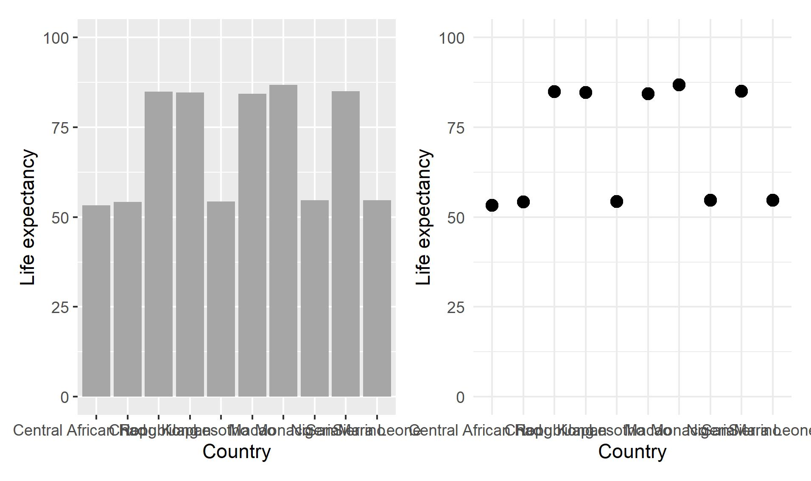
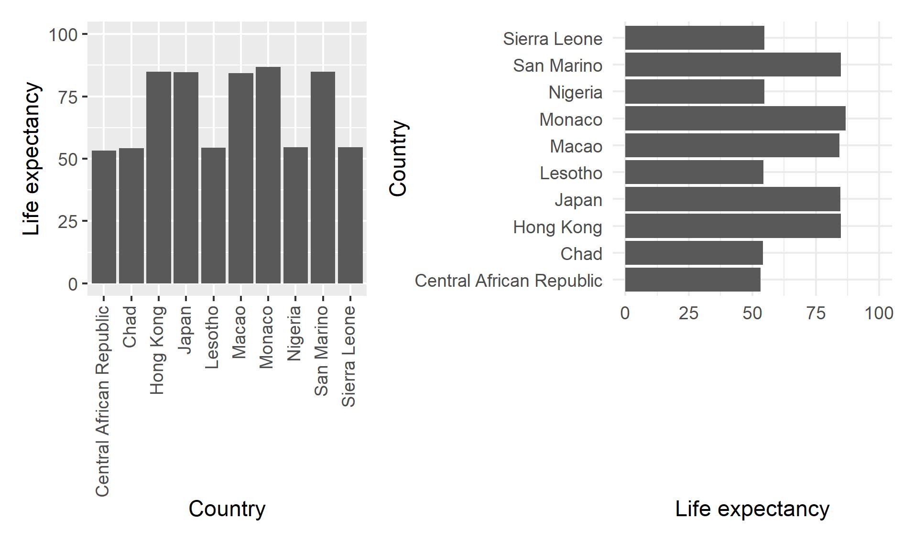
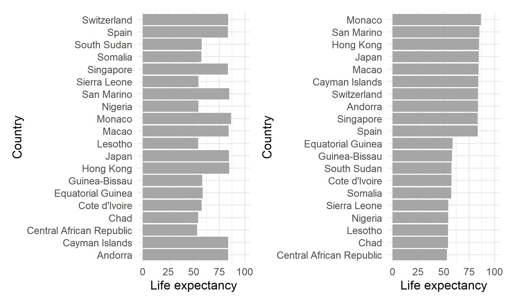
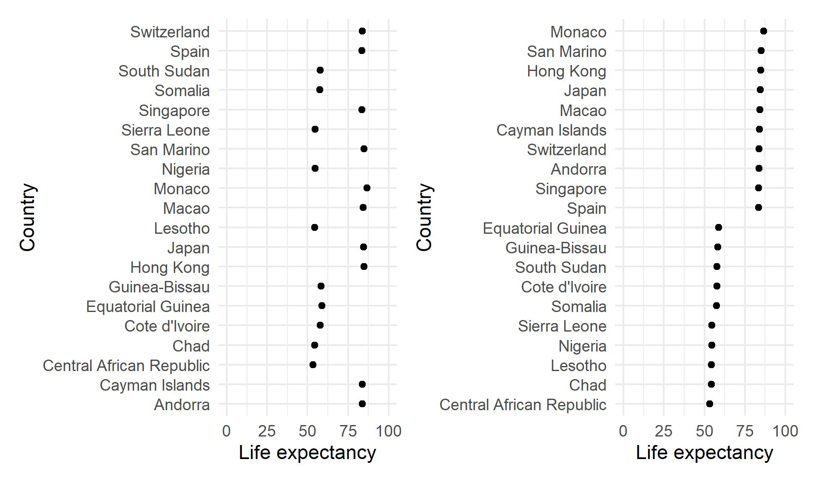
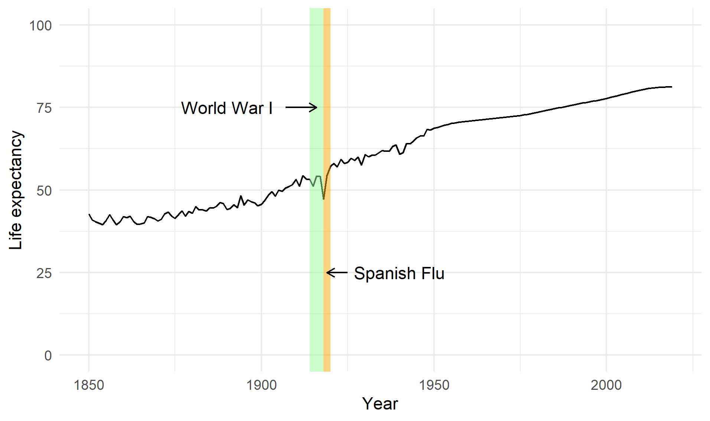
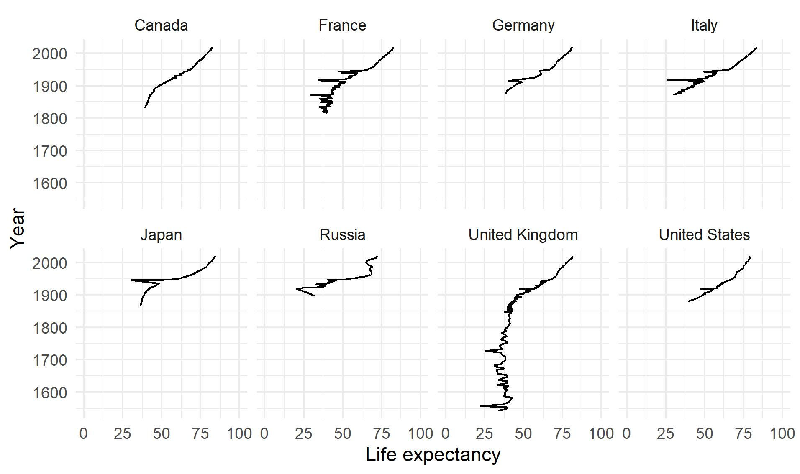
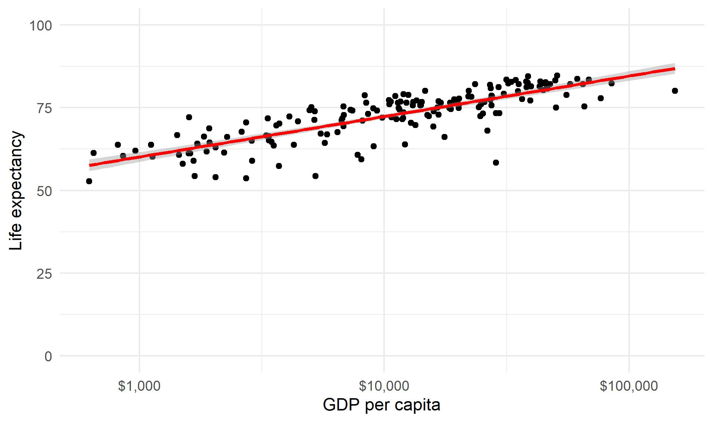

**The blog first appeared on Towards Data Science on July 08th, 2021. ([Link](https://towardsdatascience.com/six-guidelines-for-good-visualizations-7c1831cda29f?sk=d87e6228f06e6e8655dadad1a08e4e65))**

Here I discuss six guiding principles that I find very effective for creating good visualizations. Some are learned from experience/observations and others by the teaching of the pioneers of data visualizations.

> “Good design is a lot like clear thinking made visual.”
— Edward Tufte

This is not an exhaustive list but a great starting point in the world of data visualization. The six guidelines that will be discussed are:
1. High data density

2. Meaningful labels

3. Order

4. Highlighting

5. Small multiples/Less is more

6. References/guiding lines

Let’s get started.

----

## High data density

When creating visuals, always strive to achieve high data density. So, what does **high data density** means? High data density can be interpreted as the **_ratio of data to ink_**. Adding more ink to the visualization does not necessarily add value but can sometimes be distracting. The charts shown below have the same data plotted but in different formats. The left chart is a bar plot and the right one is a scatter plot. By controlling the amount of ink used the same information is conveyed but with fewer distractions.

> “Graphical excellence is that which gives to the viewer the greatest number of ideas in the shortest time with the least ink in the smallest space.” — Edward Tufte

Another possibility to minimize the amount of ink in the chart is by using a white background for the chart.

## Meaningful labels

The labels along with the data help create great visualizations. A chart without data labels or axis labels is meaningless as it fails to convey the right information. As seen in the previous section, the name of the countries on the x-axis are overlapping and thus not readable. This can be fixed by rotating the text vertically, as seen in the left chart below. The issue with the text aligned vertically on the x-axis is distracting to the viewer and removes focus from the main story as the human mind prefers to read text that is oriented horizontally. The best option is to flip the x- and the y-axis as done for the chart on the right side. This orients the labels horizontally and they are also not overlapping with each other.

One should also bear in mind not to use shorthand notations while labeling ticks especially for categorical data and also make sure the text labels are oriented such that they are easy to read.

## Order

To get better insights from the data, it is always good to order the data when displaying. When dealing with categorical data, by default, the ggplot orders the data in alphabetical order. This can make your graphs look more chaotic. The focus here should be the data being displayed properly rather than the order of the categorical variables. Arranging the data in ascending or descending order will convey the right message send without leading to misinterpretation of the data. The below figure clearly demonstrates arranging data helps answer question that may arise looking at the data, such as:

Which country has the highest life expectancy?

or

Which country has the lowest life expectancy?

Similarly, the data can also be plotted as a scatter plot that answers the above questions and is more aesthetically pleasing.

## Highlighting

In certain cases highlighting data can add more value than rather leaving it as it is. Taking the example of the life expectancy data for the United Kingdom which is plotted below. Although the data shows an upward trend meaning the overall life expectancy is improving over the years, some blips are visible along the path. To answer these blips we can highlight them and label them as shown below. In the below chart the blip around 1915 is marked and labeled telling the reason for the sudden decline in the life expectancy in the United Kingdom.

Adding certain data labels can help us understand the outliers or extreme values. Adding labels to these types of data points helps send the correct information why these data points were not excluded but rather labeled. The chart below shows the relationship between the life expectancy or life quality of citizens and the amount of GDP per capita of the country. The labeled point on the extreme right is the country with the highest GPD per capita and the point labeled on the left is the country with the lowest life expectancy.

## Small multiples/Less is more

When dealing with a large amount of data especially time series, animating the time series is a great option to convey large information in chunks. This is only possible when the data is being presented in a digital format. In print format, this is not possible so creating subsets of the original data is more meaningful. By arranging the plots along the common axis, it is easy to do comparisons rather than creating different charts. On comparing the plots the effect of Spanish flu is clearly visible in the European countries around the 1920s.

Creating small multiple charts instead of animation has its own pros and cons. For human mind it is much easier to analyse the information which is present at the same time rather in motion.

## References/Guiding lines

A guide to the eye is always appreciated when dealing with continuous datasets. Generally, data fitting is done when dealing with continuous data. The data fitting can be linear, spline, or higher-order polynomials. These data fittings convey two things: the trend and the relationship between the variables.

The below chart conveys the following message that there is a positive trend (slope of the line is positive) and the relation between the two variables is linear.

----

The complete code:

----

## Key takeaways

Here the six guidelines to enhance your data visualizations are discussed which are easy to implement. The key takeaways are:

1. Try to plot data with more empty space in the chart canvas.

2. Label necessary text and highlight the necessary areas of the chart.

3. When working with categorical data arrange the data in ascending/descending order.

4. Break the complex data into multiple plots.

5. Where ever possible, add a trend line to help better understand the data.

----

### Data sources:

https://ourworldindata.org/life-expectancy

https://ourworldindata.org/grapher/life-expectancy-vs-gdp-per-capita

### References:

1. The Visual Display of Quantitative Information — Edward Tufte

2. How to Display Data Badly — Howard Wainer

3. ggplot2: Elegant graphics for data analysis — Hadley Wickham

4. Storytelling with Data — Cole Nussbaumer Knaflic

Link to the [Github repository](https://github.com/amalasi2418/Blog-post/tree/master/Blog%2016-%20Dataviz%20guidelines).