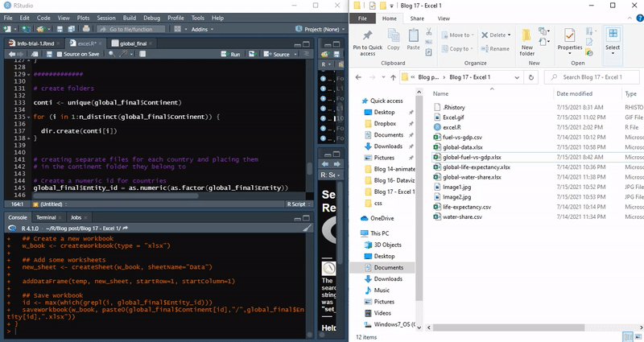
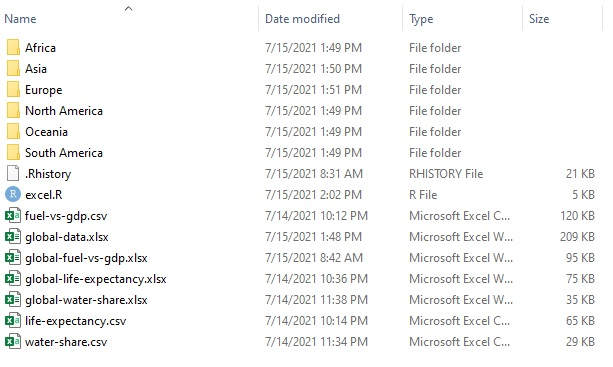
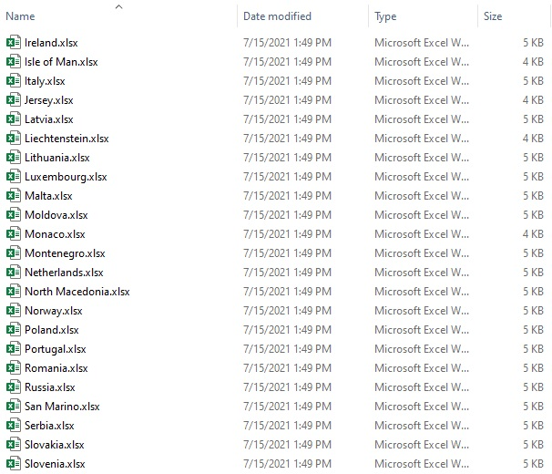

**The blog first appeared on Towards Data Science on July 16th, 2021. ([Link](https://towardsdatascience.com/excel-ing-with-r-automating-excel-52648568229c?sk=3c6227a02ba87ede22f0a9db553ebbea))**

One of the beauties of the data analytics field is its openness to multiple tools. The field has already shown that knowledge of one single tool is a handicap. In order to survive and grow in this field, you ought to be:

> Jack of all trades and master of some. — unknown

Excel is one of the prominent tools when dealing with data in the majority of businesses. I myself had the experience of working with Excel for data analysis and found few shortcomings working with them. The problems faced by me were not my own but the majority of also users face them.

Here, I pitch my reasons to switch from Excel to open-source programming languages or rather leverage their power:

1. Excel columns do not demarcate between inputs and outputs.

2. The user-defined formulas are not intuitive as instead of variable names cell locations are labeled.

3. Opening/handling large-sized files are slow and the system often crashes (the business cannot often upgrade computers).

4. Merging different Excel files into a single file is cumbersome and similarly dealing with different sheets within a single file.

5. Excel is behind the paywall.

As already mentioned, open-source programming is one of the options and here I will be using R to automate simple Excel file handling.

The topics covered are:

1. Machine-readable file naming

2. Reading Excel files

3. Merging Excel files

4. Splitting Excel files

5. Create multiple Excel files

### Objective

_The objective is two read three Excel files with global data related to life expectancy, GDP expenditure, natural fuel usage, and water availability. Merge the files into a single Excel file with three sheets and save them in the working folder. Combine the three sheets into one using `Outer Join` and save the data for each country into their corresponding continent folder._



So, let’s get started.

----

## Machine-readable file naming

Proper naming of files is important as it comes in handy when dealing with automation. The best way to name a file should be such that it is machine-readable. Try implementing the following rules when naming the files:

1. Avoid accented characters, spaces, and avoid case-sensitive text.

2. Use delimiters or separators such as “-” or “_”.

3. Use machine-readable date formats such as YYYY-MM-DD.

4. Add version control at the end for easy navigation (e.g. -01,-02,…,-10).

An example of naming a file: 2021–07-15_Excel_Automation-01.xlsx

## Reading Excel files

For reading the files, the `xlsx` package is used. There are two functions: `read.xlsx()` and `read.xlsx2()` to read files in `xlsx` package. `read.xlsx2()` is fast and efficient when dealing with large datasets. Here the below code is for reading Excel workbooks with one sheet.

```{r}
# reading individual files
fuel <- read.xlsx2("global-fuel-vs-gdp.xlsx",sheetIndex = 1)
life_exp <- read.xlsx2("global-life-expectancy.xlsx",sheetIndex = 1)
water <- read.xlsx2("global-water-share.xlsx",sheetIndex = 1)
```

Since we are here for automation, so let us look into that. To approach the problem of reading multiple files, use list.files() function to create a list containing names of all the files of interest. Store the Excel data from individual sheets into data frames. Use a proper naming convention for the defined data frame objects as it will help in automation. The assigning of data frames to individual sheets is achieved by two For loops and assign() function.

```{r}
# set the working directory
setwd("C:/Users/amalasi/Documents/R/Blog post/Blog17-Excel1")
```

<script src="https://gist.github.com/amalasi2418/53721c595995ca1f7d84eb1b2d23b253.js"></script>

## Merging Excel files

Once the Excel data has been loaded, the data is ready for processing. Here two possible ways of data merging are discussed. _The first path is to create a single workbook containing multiple sheets corresponding to all the workbooks' sheets. The second path is to merge all the sheets in the workbook created in the first path into a single sheet._

### Creating a single workbook with multiple sheets corresponding to multiple sheets of all the workbooks

By using the `write.xlsx()` function inside a for loop can help add multiple workbooks with multiple sheets into a single workbook as different sheets. Care should be taken when using the `write.xlsx()` function, for the first time make sure to set the `append` parameter value to its default, which is FALSE. This creates the workbook and to add individual sheets to this workbook, just set the parameter `append=TRUE`.

<script src="https://gist.github.com/amalasi2418/2f6b1023cd29dd5152e656a07c941f97.js"></script>

### Creating a single sheet by combining multiple sheets of the workbook

The trick here is to remember to name all the temporary data frames that are created during the automation process to have a set pattern (remember convention defined in machine-readable file naming). This helps tremendously at least in this part.

The objective of this exercise is to merge the sheets using an _outer join_. To do so, create a list of all the relevant data frames that will be combined to create a single data frame or sheet. Using `ls()` and `mget()` functions, the list of temporary data frames are created and assigned to the object named _local_list_. By defining the list object, the data frames can be easily manipulated inside a For loop. This chunk of code will create an object named _global_final_ with all the data merged into a single sheet.

<script src="https://gist.github.com/amalasi2418/ffe90f96a76baa93fa8e95af1cea4fd8.js"></script>

## Splitting Excel files

When dealing with a bulky workbook with multiple sheets, all the individual sheets can be extracted and assigned to individual data frames using the below code. This is achieved by using the `getSheets()` function.

<script src="https://gist.github.com/amalasi2418/ff3b4e8ebb68d42d8ac6633ecba83d09.js"></script>

## Create multiple files and folders

The last objective was to create country-specific files and save them in the folders corresponding to their respective continents. Here are two steps that are required to full fill the objective.

The first step is to create the folders named after the continents which are achieved by using the `dir.create()` function.

The second step is to split the sheet into multiple data frames with information for individual countries and save them. Start with indexing the individual countries as this helps in creating For loop. Next, using `filter()`, extract the country information and store it in a temporary object. Then create a workbook, define a sheet and write the data to the sheets. The final step is to save the files in the destination folders.



<script src="https://gist.github.com/amalasi2418/f0c5e2c583d44f01e2fde1f213bb2092.js"></script>

----

The link to the complete code is [here](https://github.com/amalasi2418/Blog-post/tree/master/Blog%2017%20-%20Excel%201).

<script src="https://gist.github.com/amalasi2418/48d1648979a494cf6faeb0115e27a6d7.js"></script>

----

## Conclusion

The article clearly demonstrates spending few hours scripting the code in R and can save a tremendous amount of time over the long run in merging and splitting multiple Excel files.

The above code is independent of the number of sheets in a workbook and can handle sheets with varying data columns.

The key learning was: defining machine-readable file naming conventions and reading, writing, merging, and splitting multiple Excel sheets and workbooks.

The next steps will be to use pivot tables, Vlookup, and other Excel functions using R.

### Data source

https://ourworldindata.org/grapher/life-expectancy

https://ourworldindata.org/water-sanitation-2020-update

https://ourworldindata.org/energy-poverty-air-pollution

Link to the [Github repository](https://github.com/amalasi2418/Blog-post/tree/master/Blog%2017%20-%20Excel%201).
