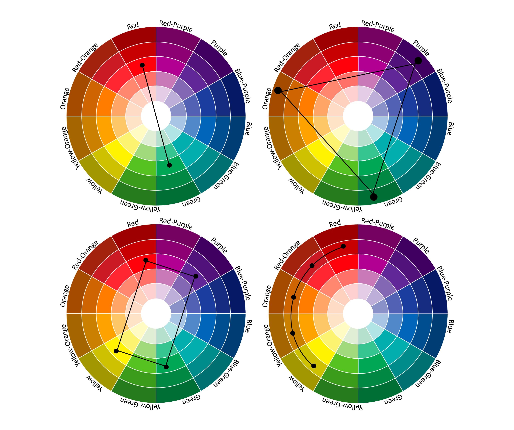

**The blog first appeared on Towards Data Science on Feb 14th, 2021. ([Link](https://towardsdatascience.com/creating-your-own-color-palette-for-data-visualization-part-1-84df48954845?sk=b48e10721bf318cef334ce16e3eea7c1))**

Do you face difficulty choosing the right color combinations for your data visualizations? Are you still stuck using the color palettes most of the programmers are using? If you want to stand out then this post is for you.

Have you ever wondered, how designers, painters, cinematographers, and photographers choose the perfect color combinations? The perfect visualizations depicted by them are carefully curated by understanding what they want their audience to perceive. The perfect blend of colors and their vision provides an engaging visualization that not only is soothing to the eye but is aesthetically appealing. The trick used by the above-mentioned professions is that they know how to use the color wheel to make that perfect blend of colors. The color wheel was first made by nonother than Sir Issac Newton. Sir Issac Newton has contributed in various fields but let’s keep our focus on the current topic of the color wheel.

## Color wheel

There are two types of color wheels, one is digital and the other one consists of paints used by painters. The major difference between these two color wheels is the difference in the components of primary colors. The digital color wheel consists of RGB (red-green-blue) and for paints, it is RYB (red-yellow-blue). Mixing two primary colors result in secondary color and a combination of primary and secondary color results in tertiary color.

## Color theory

The color theory guides choosing color combinations for visual effects or creating a color mix that can be vibrant, contrasting, or harmonious in nature. This is evident in nature as well, if one sees the rainbow, the transition of colors from red to blue are in harmony and relaxing to the eyes. And on this principle, the color wheel is made.

----

## Understanding the color combinations

There are plenty of ways to choose colors for your color palette. The choice depends on what one wants to perceive once the colors are put to use. Are you looking for a color harmony or a contrasting image? If already not decided then try implementing different color schemes as discussed below.



For demonstration purposes, I will be using the mtcars dataset from the R data repository.

_First thing to know about ggplot2 package is that they have their own color palettes. An interesting feature the ggplot2 package provide its end users is the flexibility to create their own color palette by **scale_color_manual()** function._

Let’s understand the different color combination schemes and try visualizing them.

**Complementary** colors are used for creating high contrast and impactful images as the colors are situated on the opposite ends of the color wheel (top-left image of the color wheel).

Here the plot shows the relation between gross horsepower and the weight of the cars for cars with automatic or manual transmission.

```{R}
# implementing complementary colors
(plot1 <- cars %>%
    ggplot(aes(wt,hp)) +
    geom_point(aes(color = factor(am)), size = 4) + 
    scale_color_manual(values = c("#d12e9f","#2ed160")) +
    theme_classic() +
    xlab("Weight (1000 lbs)") +
    ylab("Gross horsepower") +
    theme(panel.border = element_rect(colour = "black", fill=NA)))
```


**Triadic** color combination is a selection of 3 equispaced colors from the color wheel creating vibrant and high contrasting images (top-right image of the color wheel).

The box plot helps to understand that as the number of cylinders increases, the mileage of the car decreases.

```{R}
# implementing triadic color scheme
(plot3 <- cars %>%
  ggplot(aes(mpg,cyl)) +
  geom_boxplot(aes(fill = factor(cyl))) + 
  scale_color_manual(values = c("#EB14D7","#D7EB14", "#14D7EB"), 
                     aesthetics = c("colour", "fill")) +
  theme_classic() +
  xlab("Miles/(US) gallon") +
  ylab("# of cylinders") +
  theme(panel.border = element_rect(colour = "black", fill=NA))
```


**Tetradic** color combination, as the name suggests choosing four colors that form the corners of a rectangle or a square in the color wheel. This creates a color palette of dominant color and accent colors. Accent colors make it bolder and emphasize the contrast (bottom-left image of the color wheel). This color scheme is basically two sets of complementary colors as the opposite corners of the rectangle/square are complementary to each other.

**Analogous** color scheme works like the tetradic color combination. But here we choose colors along the circumference of the color wheel. Start with a dominant color and move towards accent colors (bottom-right image of the color wheel).

**Monochromatic** color scheme, as the name suggests creating the color gradient from darker to lighter shade. This is achieved by going radially inwards from the circumference towards the center of the color wheel. This style is visually soothing to the eyes as the color scheme is harmonious (bottom-right image of the color wheel).

The histogram compares the mileage of all the Mercedes models in the dataset.

```{R}
#implementing monochromatic color scheme
# defining the color gradient
col_grad <- c("#6F4995","#8F69B6","#A789C5","#BCA5D3","#CDBBDE",
              "#DDD1E9","#EAE3F2")
# filtering Merc models to compare the mpg
(plot5 <- cars %>% filter(str_detect(cars, "^Me")) %>%
  ggplot(aes(fct_reorder(cars, mpg, .desc = TRUE), mpg, col = cars)) +
  geom_bar(stat = "identity", aes(fill = cars)) + 
  scale_color_manual(values = col_grad, 
                     aesthetics = c("colour", "fill")) +
  theme_classic() +
  xlab("Merc models") +
  ylab("Miles/(US) gallon") +
  theme(axis.text.x = element_text(angle = 45, hjust = 1), 
        panel.border = element_rect(colour = "black", fill=NA)))
```


----

## Conclusion

So we saw that by properly following the properties of the color wheel and choosing the right scheme we can easily develop over own color palette. This process requires a lot of time to choose the right set of colors for your visualization as it forms an integral part of your data storytelling apart from the data and the story flow itself.

This is the right direction to choose your colors for your visualization if you are a person who loves to explore by themselves and try to come up with their own unique styles. If you are not this type of person then no worries, there are a lot of inspirations worth exploring to enhance your visualization color choices to a whole new level. Here are my top 5 links for inspirations:

https://color.adobe.com/create/color-wheel

https://www.canva.com/

https://coolors.co/

https://colorhunt.co/

https://www.design-seeds.com/by-color/

----

Link to the [code](https://github.com/amalasi2418/Blog-post/tree/master/Color%20palette-part%201).
