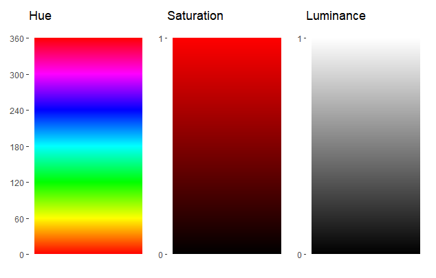
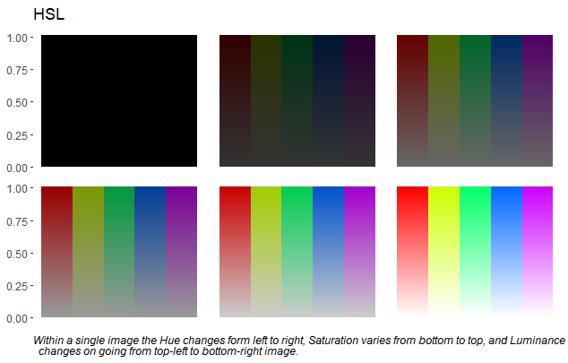
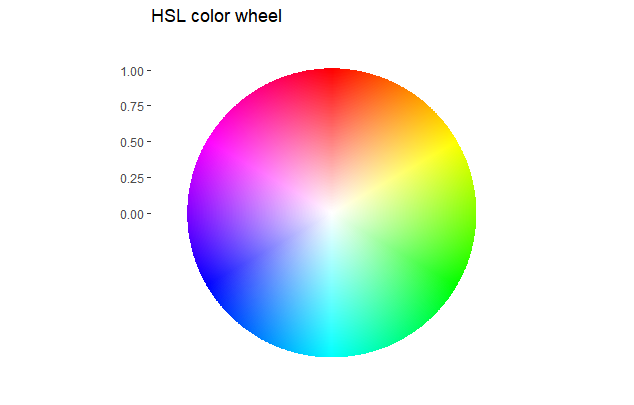

In the first part of the blog, we focused on the color theory and color wheel discussing different ways to choose the color combinations that could be either complementary, triadic, tetradic, analogous, and monochrome. The color choice drastically varied the visual perception from being contrasting to having a soothing effect on our eyes. The combinations that were made were done purely by choosing different colors from the color wheel.

Here we discuss how new color combinations can be created by blending colors with either black, white, or gray. By varying the intensity of black, white, and gray beautiful color gradients can be created. The next section covers the basic definitions and brushes over the mathematical foundation without going deeper.

Now we will be focusing on alternative ways to enhance the visuals by understanding the effects of hues, shades, saturation, tones, tints, and luminance.

> “Mere color, unspoiled by meaning, and unallied with definite form, can speak to the soul in a thousand different ways”. ~Oscar Wilde

## Shades of black, white, and gray

The RGB values are specified as (red, green, blue) and the intensity of each color varies between (0,255). So, for a red color RGB value is (255,0,0), for green color it is (0,255,0) and for blue color it is (0,0,255). Sometimes, the intensity values are defined in the range of (0,1). The conversion is simply dividing the RGB values by 255. So, for the red, green, and blue colors the RGB values in the (0,1) scale will be:

```
Red color  |(255,0,0) is equivalent to (1,0,0)
Green color|(0,255,0) is equivalent to (0,1,0)
Blue color |(0,0,255) is equivalent to (0,0,1)
```

The RGB color combinations can be further tuned as:

**Shades** of color can be generated by blending them with black color. Black is (0,0,0) in RGB format.

The **tint** of color is generated in a similar way as the shades but by blending the color with white. White is (1,1,1) in RGB format.

**Tones** on the other hand are generated by blending the color with gray. In RGB format the gray color is (0.5,0.5,0.5).

If the RGB color format is converted to the cylindrical coordinate system then the HSL system originates. HSL stands for Hue, Saturation, and Luminance.



**Hue (H)** represents the angle of the color with the dominant energy in the visible light spectrum. The angle varies between (0°,360°), and in terms of color, it starts with red and shifts to yellow to green to cyan to blue to magenta and back to red.

Let us now look at the math behind converting the RGB values to the HSL color system. There are 3 variables R, G, and B so there are 6 possible ways to arrange RGB without repeating any color twice or thrice. The possible outcomes are and the formulas associated with them for conversion to HSL:

```
a) R>G>B then H = 60° * [(G-B)/(R-B)]
b) R>B>G then H = 60° * [6-(B-G)/(R-G)]
c) G>B>R then H = 60° * [2+(B-R)/(G-R)]
d) G>R>B then H = 60° * [2-(R-B)/(G-B)]
e) B>R>G then H = 60° * [4+(R-G)/(B-G)]
f) B>G>R then H = 60° * [4-(G-R)/(B-R)]
```

The **saturation (S)** of color tends to tell its brightness. It is measured on a scale of (0,1). The 0 value represents the absence of color and 1 represents the color at its full brightness. To calculate the value of saturation, the maximum and minimum values of RGB are required. This means the max/min value is calculated comparing the values of R, G, and B.

```
S = [(max(RGB)-min(RGB))/255]/(1-(2L-1)) if L<1
S = 0 if L =1
```

**Luminance (L)** on the other hand defines the intensity, luminosity, or brightness of the color on a scale of (0,1) where 1 represents the bright region and 0 the dark region or the pure color.

```
L = (max(RGB)+min(RGB))/(2*255)
```

The **chroma (C)** on the other hand is the purest form of color without any blendings of either white, black, or gray colors. It is also measured between the scales of (0,1).

Now we have all the definitions we need to know about colors, let's put all this knowledge to build our code.

## Converting RGB to HSL

There are 2 ways we can convert RGB to HSL. The first method is to use the formulas defined in the previous section. The second and the shorter route is to use the `rgb2hsl()` function form the **plotwidgets package** of R. I will provide the code for the first method and the second method is left for the readers to explore.

```{R}
# Converting RGB to HSL

# input RGB value between 0-255
RGB <- c(123, 24, 189)

############# Calculating Hue ##############
H <- 0

# calculating max and min indices
max_RGB <- which.max(RGB)
min_RGB <- which.min(RGB)

if(max_RGB == 1 & min_RGB == 3){
  H = 60*(RGB[2]-RGB[3])/(RGB[1]-RGB[3])
  print(1)
}else if(max_RGB == 1 & min_RGB == 2){
  H = 60*(6-(RGB[3]-RGB[2])/(RGB[1]-RGB[2]))
          print(2)
}else if(max_RGB == 2 & min_RGB == 1){
  H = 60*(2+(RGB[3]-RGB[1])/(RGB[2]-RGB[1]))
          print(3)
}else if(max_RGB == 2 & min_RGB == 3){
  H = 60*(2-(RGB[1]-RGB[3])/(RGB[2]-RGB[3]))
          print(4)
}else if(max_RGB == 3 & min_RGB == 2){
  H = 60*(4+(RGB[1]-RGB[2])/(RGB[3]-RGB[2]))
          print(5)
}else {
  H = 60*(4-(RGB[2]-RGB[1])/(RGB[3]-RGB[1]))
          print(6)
}

################# calculating L & S #################

# normalizing the RGB values to the scale of [0,1]
RGB <- RGB/255

# Calculating Luminance
L <- (max(RGB)+min(RGB))/2

# Calculating Saturation
S <- ifelse(L==1,0,(max(RGB)-min(RGB))/(1-(2*L-1)))
{"mode":"full","isActive":false}
```

By choosing a particular color the saturation and luminance can be varied as shown in the below image.



We know how to convert RGB to HSL, let’s plot and generate a color wheel for HSL parameters.

```{R}
##### GENERATING COLOR WHEEL ###########

# expand.grid() function to create all possible combinations between the variables H,S,L
HSV4 <- expand.grid(H = seq(0,1,.001),S = seq(0,1,.01), V = 1)

# color wheel 
p4 <- ggplot() +
  geom_rect(HSV4, mapping=aes(xmin = H, xmax = (H+resolution(H)), 
                              ymin = S, ymax = S + resolution(S), fill = hsv(H,S,V))) +
# resolution() tales the least count or incremental value of the variable.
  ggtitle("HSL color wheel") +
  scale_x_continuous(limits = c(0,1), breaks = seq(0, 1, .2)) +
  scale_fill_identity() +
  coord_polar(theta="x") +
  theme_classic() +
  theme(axis.line=element_blank(),
        axis.title.x=element_blank(),
        axis.text.x=element_blank(),
        axis.ticks.x=element_blank(),
        strip.text.x = element_blank())
{"mode":"full","isActive":false}
```



For plotting HCL, where C is chroma, one can use `hcl()` function instead of `hsv()` in the above code.

## Converting HSL to RGB

For this part, we will ignore the mathematics for converting HSL to RGB and can directly use the `hsl2rgb()` function from the **plotwidgets package** of R. The input argument for the `hsl2rgb()` function is a matrix of 3 rows. The 3 rows represent the HSL values where H varies between (0°,360°). And the resulting output is also a matrix of 3 rows identified as RGB.

----

## Conclusion

So, we successfully demonstrated that by controlling the amount of black, white, or gray colors new color combinations can be created by blending them with pure colors. These combinations are color gradients of a single color. Further, getting to know about the difference in luminance, saturation, tints, and tones provides us the flexibility to blend the black, white, and gray colors in the right proportions to create color gradients of choice.

### References

https://www.xspdf.com/resolution/54613930.html

https://donatbalipapp.medium.com/colours-maths-90346fb5abda

https://stackoverflow.com/questions/6615002/given-an-rgb-value-how-do-i-create-a-tint-or-shade/6615053

https://www.december.com/html/spec/colorcodes.html

The link to the complete code is [here](https://github.com/amalasi2418/Blog-post/tree/master/Color%20palette-part%202).