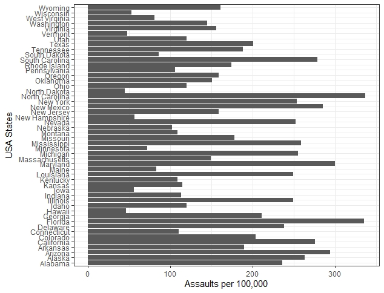
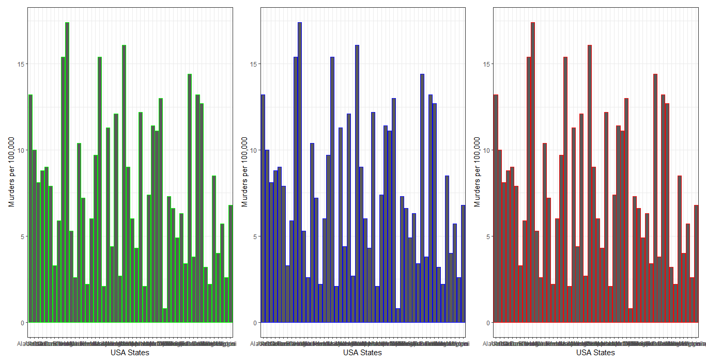
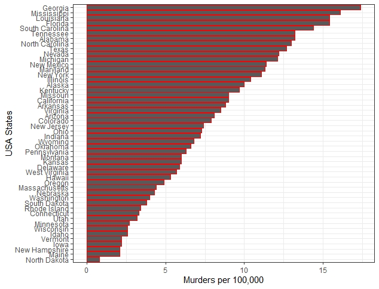

**The blog first appeared on Towards Data Science on Feb 9th, 2021. ([Link](https://towardsdatascience.com/data-visualization-using-ggplot2-5-features-worth-knowing-c0447a760335?sk=73118287f17ef06b421d35c708873deb))**

Whether you are working on your school project, term paper, master’s thesis, or a business presentation, the quality of the data translates well to the audience if the data is presented in a meaningful and aesthetically pleasing way. Although making an impactful figure from the data is challenging and time-consuming, but some small tips if implemented properly can make the workflow simpler and save a lot of time over the long run.

In this post, I will be discussing 5 tips or features that I find useful and implement on a regular basis while working with the ggplot2 package. Maybe some of you will already know them and for some, it will be something new.

To give a little background about ggplot2, it is developed based on the grammar of graphics in short gg. The plot consists of three fundamental parts, namely:

1. Data: consisting of the data frame
2. Aesthetics: defining the x and y variable and detailing the color, size, and shape of the data points
3. Geometry: defines the type of plot e.g. bar plot, line plot, scatter, histogram, etc.

----

So, let's dive in to see the 5 features/tips that I want to share with you all that have been very handy to me. For demonstration purposes, I will be using the USArrests dataset from the in-built R data repository.

**Tip #1: Using parentheses while assigning ggplot function to a variable**

A cool thing in the ggplot2 package is the use of parentheses. In general, while plotting using ggplot function, if we assign it to a variable then in order to plot, the variable is executed in the next line. So, this is a two-step process. By putting the ggplot function in the parentheses when assigning helps plot the figure directly without executing the variable again.

```{R}
# two step way to plot
plot <- USArrests %>% ggplot(aes(States, Murder)) + 
  geom_bar(stat = "identity")
plot
# one step way to plot using parentheses
(plot <- USArrests %>% ggplot(aes(States, Murder)) + 
  geom_bar(stat = "identity"))
```

**Tip #2: Minimizing repetitive ggplot function by switching data**

This command simply is very useful during the EDA stage when I try plotting different sets of variables to understand the relationships. Instead of writing ggplot commands, again and again, I prefer to use %+% from the tidyverse package. By using %+% we can override the current data with the new data.

```{R}
# lets define a temporary variable
temp <- USArrests[,c(1,3)] %>% rename(Murder = Assault)
# switching the current data with the temp variable using %+% operator
plot2 <- plot %+% temp
# plotting the new graph
plot2 + ylab("Assaults per 100,000")
```



_Warning: For %+% to work, make sure the column names of the new data matches the column name of the dataset being replaced._

**Tip #3: Freedom to use col/color/colour in aesthetics**

The aesthetics of the ggplot2 package gives the freedom to choose between col/color/colour to assign the colors to the plot. So, it doesn’t matter if you use British English or American English, you are covered by ggplot.

```{R}
# plotting the same data using col/color/colour in aesthetics using green/blue/red colors to distinguish
plot3 <- USArrests %>% ggplot(aes(States, Murder)) + 
  geom_bar(stat = "identity", col = "green") +
    theme(axis.text.x = element_text(angle = 90, hjust = 1)) +
    ylab("Murders per 100,000") +
    xlab("USA States") +
    #scale_y_discrete(limits=c(0:10)) +
    theme_bw()
plot4 <- USArrests %>% ggplot(aes(States, Murder)) + 
    geom_bar(stat = "identity", color = "blue") +
    theme(axis.text.x = element_text(angle = 90, hjust = 1)) +
    ylab("Murders per 100,000") +
    xlab("USA States") +
    #scale_y_discrete(limits=c(0:10)) +
    theme_bw()
plot5 <- USArrests %>% ggplot(aes(States, Murder)) + 
    geom_bar(stat = "identity", colour = "red") +
    theme(axis.text.x = element_text(angle = 90, hjust = 1)) +
    ylab("Murders per 100,000") +
    xlab("USA States") +
    #scale_y_discrete(limits=c(0:10)) +
    theme_bw()
plot3 + plot4 + plot5 + plot_layout(ncol = 3)
```


**Tip #4: Reordering data using fct_reorder()**

To make aesthetically pleasing plots, generally, most of us use group_by(), summarize(), and arrange() functions to arrange the data. This being a lengthy step that could be replaced by a single function from the forcats package called fct_order().

```{R}
plot6 <- USArrests %>% ggplot(aes(x = fct_reorder(States, Murder, .desc = FALSE), y = Murder)) + 
    geom_bar(stat = "identity", colour = "red") +
    theme(axis.text.x = element_text(angle = 90, hjust = 1)) +
    ylab("Murders per 100,000") +
    xlab("USA States") +
    theme_bw() +
    coord_flip()
```



**Tip #5: ggsave() for saving plots**

ggsave() function provides flexibility to the users looking to save high-resolution images for publications, presentations, or printing. The ggsave function has features to adjust image size, define the resolution and adjusting the image background to be transparent or not, and flexibility to choose different file extensions.

```{R}
ggsave(
  filename = "trial.png",
  device = png(),
  path = NULL,
  scale = 1,
  width = 5,
  height = 5,
  units = "in",
  dpi = 600,
  limitsize = TRUE,
  bg = "transparent"
)
```

----

These are the 5 features that I use quite often when plotting with the ggplot2 package.

1. Using parentheses while assigning ggplot function to a variable
2. Minimizing repetitive ggplot function by switching data
3. Freedom to use col/color/colour in aesthetics
4. Reordering data using fct_reorder()
5. ggsave() for saving plots

The best way to implement the above 5 features is to keep on practicing, this is how I did. The more different scenarios you try using them the more potential you will see. Till then, happy coding.

Did you guys find these features/tips interesting? Were any of them new to you? Do share your thoughts in the comments and any tips/tricks that you use for plotting not covered here.

Link to the [code](https://github.com/amalasi2418/Blog-post/tree/master/ggplot-features%20tips%20tricks).