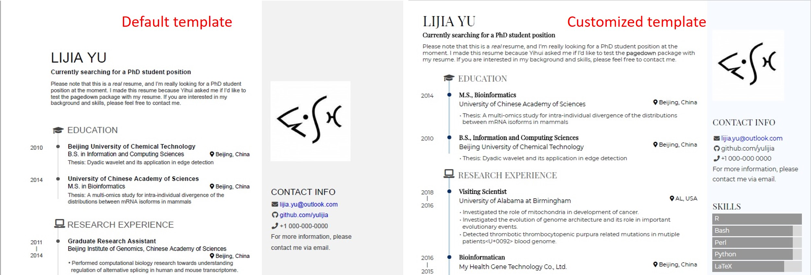
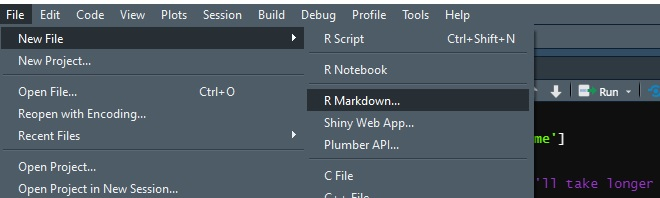
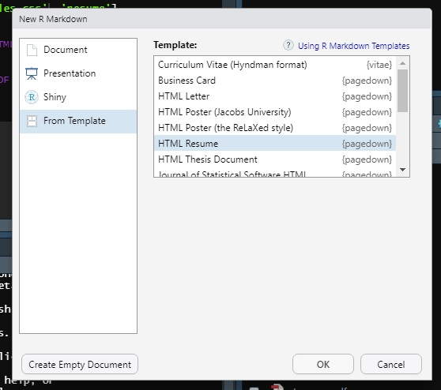
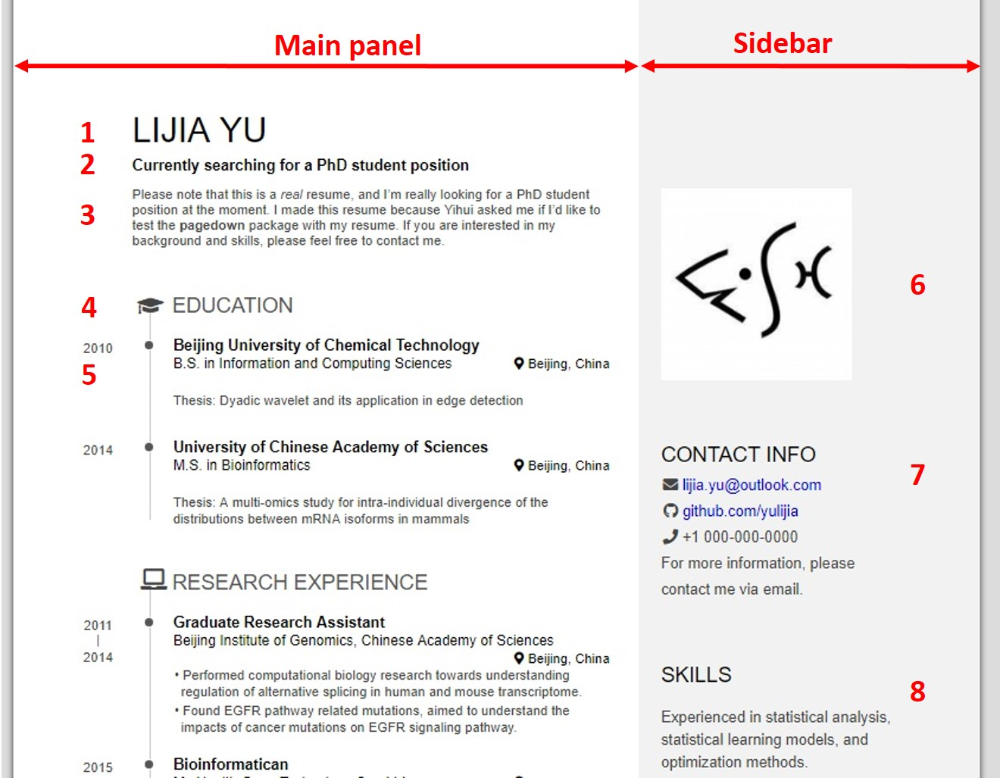
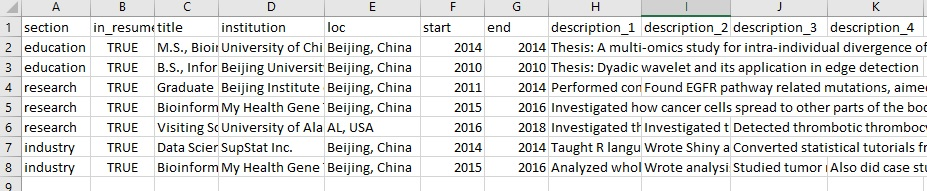

**The blog first appeared on Towards Data Science on Mar 8th, 2021. ([Link](https://towardsdatascience.com/create-your-resume-with-pagedown-package-in-r-123ca6310d52?sk=cdb42d9df59b76810e2d3dfdad823a19))**

In the past, I always dreamt of making my resume using LaTeX, but the learning curve to achieve that polished looked never materialized. So, I always ended up making my resume using word documents and silently endured the alignment struggles that entailed.

Recently, I was going through the same cycle of updating my resume and spent a lot of time on alignment. Then I thought, let’s see if there is a permanent solution to this, and by chance, I pondered upon this [lovely blog](https://livefreeordichotomize.com/2019/09/04/building_a_data_driven_cv_with_r/) by Nick Strayer, which provides a very simple solution to automate resume building by dividing sections of resume into different CSV files. And further adding an option to choose sub-sections to show up on the resume. This style gives the flexibility to create targeted resumes for different job types. The built-in resume template from the `pagedown` package takes care of the formatting of the resume. So, in a way, this is a hassle-free solution that I had been looking for long.

Inspired by the blog, I created this detailed tutorial to build the resume adding details which I felt were not adequately covered in the blog (people like me with no or very less knowledge of CSS).

> Power your data portfolio with R `pagedown` package resume template.

We will divide the resume building into the following 4 sections:

1. Resume essentials

2. Template customization

3. Print to Pdf

4. Data automation

The final goal is to get the customized template up and running as shown.



----

To make your resume in RStudio first you have to install the `pagedown` package if not already done. The package comes with an inbuilt resume template. Start by creating a new `R Markdown` document after installing the `pagedown` package.



A new window pops up on which choose the _From Template_ option and then _HTML Resume_ template by `pagedown` package and click _OK_.



This will open the default version of the Resume on your RStudio. Knit the document, it might ask you to save the document first and after that, it will compile the resume and a new window will pop up with the resume. The default resume will look like this.



----

## Resume essentials

The resume is divided into 2 panels: the main panel and the side panel. In total 8 areas have been labeled in the above image that will be explained below which will later help you to build your resume.

So for the time being we will leave the YAML header part and will get back to it later. After the YAML header chunk follows the **_Aside_** heading that is labeled as a sidebar and **_Main_** heading labeled as the Main panel in the above image. _Points 1–5 are from the Main panel of the resume and Points 6–8 are from the sidebar._ Let us go point by point (refer to the above image):

**_Point 1_**: The place holder for your name or the main heading.

**_Point 2_**: This is the sub-heading of your resume (highlight important details that you want your recruiter or hiring manager to notice).

**_Point 3_**: The summary section. You guys know well what to fill in here.

Points 1–3 are highlighted below.

```
Main
================================================================================
Lijia Yu {#title}                        [POINT 1: heading]
--------------------------------------------------------------------------------
### Currently searching for a PhD student position             [POINT 2: sub-heading]
TEXT SUMMARY                              [POINT 3: summary]
```

> In case you are not very familiar with the Markdown syntax for section headings, a series of = under a heading is equivalent to # before a heading, and a series of — is equivalent to ##. (Text from Pagedown manual)

**_Point 4_**: This is divided into 2 parts: one is defining the heading of the section (in this case it is Education) and the other is identifying an icon to represent it (graduation cap for education).

This section can be repeated to write about: Work experience, research experience, certifications, educations, etc., and the pattern will be the same. So this chunk of text can be copied repeatedly.

The icons used in the resume template are from **_[Font Awesome](https://fontawesome.com/)_** website.

**_Point 5_**: Once you have defined a section, it can further be broken down into a number of subsections. The subsection has 5 fields to fill in of which the first 4 are mandatory fields. First is the title of the sub-section, second is the sub-title of the sub-section, third is the location, fourth is the time period. The time period can be just a year like 2021 or it can be a range like 02/2020–03/2021 or 2020–2021. The fifth field is not mandatory is for supporting text and can be left empty. Points 4 and 5 are explained below:

```
Education {data-icon=graduation-cap}   [POINT 4: section heading]
--------------------------------------------------------------------------------
### Beijing University of Chemical Technology  [POINT 5: subsection                    heading]
B.S. in Information and Computing Sciences    [POINT 5: subtitle]         
Beijing, China                                [POINT 5: location]
2010                                          [POINT 5: time period] 
Thesis: Dyadic wavelet and its application in edge detection
                                          [POINT 5: supporting text]
```

> Out of the 4 mandatory fields, only the sub-title, location, and time period fields can be skipped by filling in N/A.

The fifth field is to add details to your subsections. By default, the text will be published as a single column but the display can be changed to 2-columns by using `:::concise` block as shown below.

```
:::concise
- sentence 1
- sentence 2
- sentence 3
- sentence 4
:::
```

Now let's move on to the sidebar that covers points 6–8.

**_Point 6_**: By default, a logo is inserted in the template which can be changed by any image just by adding the correct path in the text.

```
Aside
================================================================================
{width=80%}
```

**_Point 7_**: The contact info section is where you can highlight your social media pages or blogs and personal contact info. Again the icons are from Font Awesome webpage. The information in contact info can be added in the following way:

```
- <i class="fa fa-github"></i> [github.com/yulijia](https://github.com/yulijia)
```

**_Point 8_**: The skills section is where you can jot down all the skills. If you want to list the skills it can be done in the following way:

```
Skills {#skills}
--------------------------------------------------------------------------------
- skill 1
- skill 2
- skill 3
```

Till now we have covered the essential building blocks for creating the resume. The compiled resume will give you an idea of how it will look. If you are satisfied with the current version then you can skip to the end. If you are unsure of the looks of it, then let’s get to the customization part of it.

## Template customization

At first glance, if you think there is plenty of white space along the borders, or, the sidebar is too thick, or even you think the font style is way off according to your style then you need to customize it. You can even play with the colors of the timelines on the left side and the background color of the sidebar.

To address all these issues you need to know CSS. If you are a person like me with no background in CSS then read on.

_Page margins_: To override a predefined function, an asterisk (`*`)needs to be added before the function as shown in the below text. This way new margin values for the page can be defined.

```
* {
  /* Override default margins*/
  --pagedjs-margin-right: 0.2in;
  --pagedjs-margin-left: 0.2in;
  --pagedjs-margin-top: 0.2in;
  --pagedjs-margin-bottom: 0.2in;
}
```

_Sidebar width_: In the root function, the default value for sidebar width is 15 rem. This value can be changed to get the desired width of the sidebar. For the current case, it has been assigned to 12 rem.

```
 --sidebar-width: 12rem;
```

_Sidebar color_: In the root function, the sidebar background color can also be changed. For demonstration purposes, the color is switched from `#f2f2f2` to `#a2e2e2`.

_Color of timeline_: The timeline on the left side of the resume consists of vertical lines connecting dots under the same section. Both the thickness and color of the vertical lines can be changed as shown below.

```
--decorator-border: 2px solid #a2e2e2; /* change color and thickness of timeline */
```

Further, the background color of the dots can be changed as shown below.

```
background-color: #a2e2e2; /* change color timeline dots */
```

_Font type_: The font type can be changed in the body function by defining the font family. In this example, I changed the font from _Open Sans_ to _Roboto_ both from sans-serif.

```
/* Define the font family here */
body{
  font-family: "Roboto", sans-serif;
}
```

All the changes to be made for customization are defined in `override.css` file. The complete code is here:

```
* {
  /* Override default margins*/
  --pagedjs-margin-right: 0.2in;
  --pagedjs-margin-left: 0.2in;
  --pagedjs-margin-top: 0.2in;
  --pagedjs-margin-bottom: 0.2in;
}


:root{
  --sidebar-width: 12rem; /* side bar width */
  --sidebar-background-color: #a2e2e2;
  --decorator-border: 2px solid #a2e2e2; /* change color and thickness of timeline */

}

.decorator::after{
  background-color: #a2e2e2; /* change color timeline dots */

}


/* Define the font family here */
body{
  font-family: "Roboto", sans-serif;

}
```

To incorporate all the changes in the CSS file, we can override the existing CSS file completely or certain rules with a new one in the YAML header. This is done by adding the new file name with the CSS extension. The new CSS file created should be kept in the folder with the markdown file. The location of the original CSS file will be `…Resume_demo_files\paged-0.13\css\resume.css`. The folder will be created when the markdown file is knit in its default condition.

```
output:
  pagedown::html_resume:
    css: 
      - override.css         # OVERIDE CERTAIN FUNCTIONS OF CSS
      - resume               # DEFAULT FILE
```

## Print to pdf

You will notice when you knit the markdown file a window will pop up displaying the resume with the **_Open in Browser_** option on the top left. On clicking this option it will just open a blank tab on your browser. For the resume to display on the browser tab, one has to change the YAML setting from the default value of FALSE to TRUE. This can be done by setting `self_contained: false` to `self_contained: true`. Then the pdf can be generated by printing the displayed resume on the browser tab.

Another option to create pdf file is to add `knit: pagedown::chrome_print` to YAML header.

## Data automation

Now coming to the best part of the resume building where you can automate the data filling. Thanks to Nick Strayer for getting my resume from being just customized to being fully data automated. As always, you need to create the master data CSV files for all the sections of your resume. The master data can be done in 2 ways:

1. _CSV files_: Create CSV files and keep updating them as per your needs. The CSV files can be made on your personal device or on google sheets. Separate files can be made for work, skills, and contact details.

2. _Hybrid approach_: If you are in a hurry then you can directly fill in the fields in the markdown file of the resume template and will give the desired output as shown in the default resume template or with the customizations that have been incorporated. And maybe for some cases use the CSV files for adding the data. As I did in my case since I was inclined on using the skill bars to highlight the level of proficiency of my programming skills rather than just add them as a mere text. So I choose the hybrid approach.

So let me demonstrate to you what it means to automate resume building by using the text from the default resume template. The first step is to create the CSV files. Here is the example for the CSV file details of work and education history.



Once you have created the files you can use the resume template, link at the end. There are two R files associated with the template. The `gather_data.R` looks for the data source if it has to read from Google sheets or CSV files. The preference for this is indicated in the markdown file. The `parsing_functions.R` glues the relevant information in the markdown file when the functions related to education, work history, contact info, skills, etc. are called upon.

If the color of the skill bar needs to be changed then refer the `parsing_functions.R` file and look for `build_skill_bars()` function.

## Conclusion

In this article, I showed step by step to customize the default resume template from the `pagedown` package. This was achieved by breaking the workflow of the template. In the first section, the basic building blocks of the template were explained and the regions that needed attention. The second part focused on template customization finding the possible pitfalls and customizing them according to my needs. The third section was to generate a pdf version of the resume.

The fourth or the last section was on automating the data filling in the resume based on Nick Strayer’s work. In this section, I tried explaining the basic features that needed to be focused on to get the resume up and running in no time.

This way you can showcase your data skills and data portfolio powered by R `pagedown` package.

### Links to the resume templates:

Customized resume: [Link](https://github.com/amalasi2418/Blog-post/tree/master/resume)

Customized resume with automation: [Link](https://github.com/amalasi2418/Blog-post/tree/master/resume/Automate)

### References:

https://livefreeordichotomize.com/2019/09/04/building_a_data_driven_cv_with_r/

https://pagedown.rbind.io/

https://fontawesome.com/
